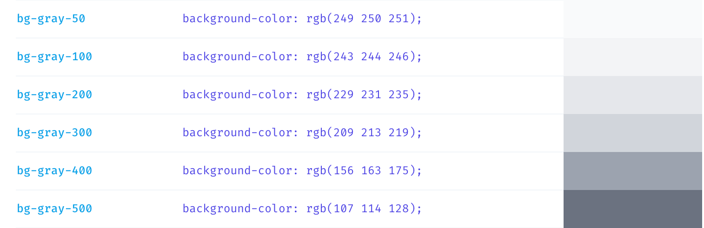
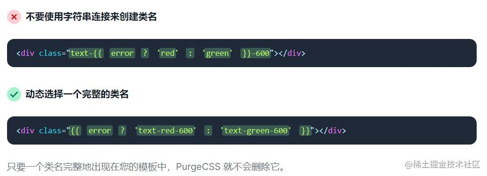

# EDC主产品线

EDC：电子数据采集系统===》临床相关的一切数据能够被记录

eTMF:	电子临床实验记录=〉临床文档管理系统

eCRF:	电子病历报告单

稽查轨迹：操作记录/日志记录

# Git 使用

## 常用指令

| 指令                |                          | 功能                                     |
| ------------------- | ------------------------ | ---------------------------------------- |
| git clone <远程url> |                          | 克隆                                     |
| git pull            | git pull                 | 当前分支下更新远端代码到本地             |
|                     | git pull origin <分支名> | 更新指定远端分支到本地                   |
| git branch          | git branch               | 查看所有分支列表                         |
|                     | git branch <分支名>      | 新建分支                                 |
|                     | git branch -D <分支名>   | 删除指定分支                             |
| git checkout        | git checkout <分支名>    | 切换到指定分支                           |
|                     | git checkout -b <分支名> | 新建分支，并切换到该分支下               |
| git add             | git add -A               | 暂存所有更改                             |
| git commit          | git commit -m  "<注释>"  | 提交更改并给与注释                       |
|                     | git commit -am  "<注释>" | 暂存并提交更改                           |
| git status          |                          | 查看所有更改                             |
| git merge           | git merge <分支名>       | 指定分支合并到当前分支下                 |
| git push            | git push                 | 当前分支推送到远端                       |
|                     | git push origin <分支名> | 指定分支推送到远端                       |
| git restore <路径>  |                          | 丢弃某文件中的改动                       |
| git stash           | git stash                | 存储当前所有修改到内存，并回退到修改之前 |
|                     | git stash -a             | 缓存所有修改(包括未跟踪的)               |
|                     | git stash pop            | 恢复修改                                 |
|                     | git stash list           | 查看缓存的修改                           |
|                     | git stash drop stash@{0} | 删除某个缓存                             |
|                     | git stash clear          | 删除所有缓存                             |
|                     |                          |                                          |

## 注意事项

- 先pull 后push		
- 修改代码，后pull，然后再建分支
- 线上解决冲突后，需要立即pull
- 只能本地解决冲突时，线将主分支合并到个人分支，然后解决冲突
- 在push之前解决所有格式问题
- cp: git cherry-pick, 挑拣某个提交

# css未知部分

## filter滤镜

### 应用场景

1、网页主题色

2、毛玻璃/虚化效果（blur）

3、立体/阴影

4、主题变灰、变棕

5、碎玻璃效果

6、高亮

7、旧照片效果

### 使用/属性

```css
/* 使用SVG filter */
filter: url("filters.svg#filter-id");			/*现成的svg滤镜*/
/* 使用filter函数 */
filter: blur(5px);	/*模糊图像 虚化效果*/
filter: brightness(0.4);  /*让图像更明亮或更暗淡*/
filter: contrast(200%);  /*图像的对比度*/
filter: drop-shadow(16px 16px 20px blue); /*在图像后方应用投影 阴影*/
filter: grayscale(50%); /*将图像转为灰度图*/
filter: hue-rotate(90deg); /*改变图像的整体色调*/
filter: invert(75%); /*反转图像颜色*/
filter: opacity(25%);	/*透明度*/
filter: saturate(30%);	/*超饱和或去饱和输入的图像*/
filter: sepia(60%);	/*将图像转为棕褐色*/
/* 多个filter */
filter: contrast(175%) brightness(3%);
/* 不使用filter */
filter: none;
/* 全局变量 */
filter: inherit;
filter: initial;
filter: unset;
```


# Tailwind语法

## 相关的网页地址

- [Tailwind官网文档](https://www.tailwindcss.cn/docs)
- [Tailwind语法搜索工具](https://nerdcave.com/tailwind-cheat-sheet)

工具集 CSS 框架，一个包含多个预定义类（所谓的工具类）的集合。你并不需要编写基础的 CSS 样式规则，只需要直接在 HTML 中应用已经事先定义好的类名

```html
<div class="bg-gray-100 rounded-xl p-8">Hello World</div>
```

```css
//bg-gray-100:
{
  --tw-bg-opacity: 1;
	background-color: rgba(243, 244, 246, var(--tw-bg-opacity));
}
//rounded-xl:
{
  border-radius: 0.75rem; /* 12px */
}
//p-8
{
  	padding: 2rem;	/*32px*/
}
```



## @apply

针对样式复杂，导致html标签的类名过多，提出@apply语法

```html
<div class="bg-red-200 w-4 text-gray-400 rounded-sm border-red-400 border-2"></div>
```

```css
.header {
  @apply bg-red-200 w-4 text-gray-400 rounded-sm border-red-400 border-2;
}
```

```css
.header {
  background-color: #FECACA;
  width: 200px;
  color: #444;
  border-radius: 5px;
  border: 2px solid #F87171;
}
```

## css变量写法

```css
background-color: var(--primary-color);
```


## PurgeCSS工具

项目引入Tailwind后所有类名都可用，但是实际项目打包的时候并不需要所有类名，此时使用purgeCSS工具可以使项目打包时，只包含使用过的类名

PurgeCSS 会分析你的内容和 css 文件，首先它将 css 文件中使用的选择器与内容文件中的选择器进行匹配，然后它会从 css 中删除未使用的选择器，从而生成更小的 css 文件。

但是，使用该工具后，无法使用拼接字符串形式，实现动态样式。




## 自适应布局

| 断点前缀 | 最小宽度 | CSS                                  |
| -------- | -------- | ------------------------------------ |
| `sm`     | 640px    | `@media (min-width: 640px) { ... }`  |
| `md`     | 768px    | `@media (min-width: 768px) { ... }`  |
| `lg`     | 1024px   | `@media (min-width: 1024px) { ... }` |
| `xl`     | 1280px   | `@media (min-width: 1280px) { ... }` |
| `2xl`    | 1536px   | `@media (min-width: 1536px) { ... }` |

```html
 <div class="w-28 h-5 bg-gray-500 sm:h-28 sm:bg-gray-200"></div>
```

### 自定义断点

```js
//tailwind.config.cjs
/** @type {import('tailwindcss').Config} */
const defaultTheme = require('tailwindcss/defaultTheme')
module.exports = {
  content: [],
  theme: {
    extend: {},
    screens:{
      'lpin': '3024px',
      ...defaultTheme.screens,
    }
  },
  purge: ['./index.html', './src/**/*.{vue,js,ts,jsx,tsx}'],
}
```

```html
<div class="w-28 h-5 bg-gray-500 sm:h-28 lpin:bg-red-900"></div>
```


# postcss工具

# PrimeVue组件库

# TypeScript

## ts文件模版

```tsx
import { useInstance } from '@/utils/instance-utils';
import { reactive } from 'vue';

import { Study, useStudyModule } from '../study';
import {
  SelectTreeModule,
  useSelectTreeModule,
} from '@/components/select-tree/select-tree';

//state中变量调用方法，本文件中 this.state.***。其他文件 **.state.**
export class PredefinedFileConfigState {
  loading = false;
  activeItemKey = '';
  isEditor = false;
  menuItems: Tree[] = [];
  activeIndex = 0;
  predefinedFileList: Array<PredefinedFileData> = [];
  predefinedFileForm: PredefinedFileForm = new PredefinedFileForm();
  etmfConfigVisible = false;
  placeholderPath = '';
}

export class PredefinedFileConfigModule {
  //构造函数
  constructor(
    public state: PredefinedFileConfigState,
    public readonly study: Study,
    private selectTree: SelectTreeModule
  ) {}

  //变量  调用 this.** 不需要（），返回return的值，是变量不是方法
  get isEditor(): boolean {
    return this.state.isEditor;
  }
  
	//方法 this.**()
  initSelectedNode() {
    this.selectTree.initSelectedNode();
  }

  convertPredefinedFileToMenuItem(
    predefinedFileItem: PredefinedFileData
  ): Tree {
    return {
      ...
    };
  }
}

  //固定格式，调用构造函数
export const usePredefinedFileConfigModule =
  useInstance<PredefinedFileConfigModule>(
    Symbol('PredefinedFileConfigModule'),
    () => {
      const study = useStudyModule();
      const state = reactive(new PredefinedFileConfigState());
      const selectTree = useSelectTreeModule();
      //调用构造函数，参数有顺序
      return new PredefinedFileConfigModule(state, study, selectTree);
    }
  );

```

## 创建类和继承

```tsx
export class PredefinedFileForm implements PredefinedFileData {
  id = '';
  workspaceId = '';
  placeholderId = '';
  placeholderName = '';
  path: Array<KeyAndFolderName> = [];
  tag = PredefinedTag.Ccg;
  description: I18nText = { uNSPECIFIED: '' };
  name = '';
  uploaded = false;
}
```

## 创建枚举型变量

```tsx
export enum GetSubItemsTo {
  More = 'more',
  First = 'first',
  Update = 'update',
}
```

## 创建类型

```tsx
export interface Page {
  total: number;
  pageIndex: number;
}
type Props = {
  cardsInfo: Array<CardInfo>;
};
```

## 报错

### 1、必须具有返回迭代器的 "[Symbol.iterator]()" 方法

#### For of遍历对象

```tsx
//name是普通对象
for(const {key,value} of name)//name报错
```

#### 解决方法：Object.entries()

```tsx
for(const [key,value] of Object.entries(name))
```

#### Object.entries()使用

将对象变成可遍历的键值对数组

```js
const obj = { a: '1', b: '1' };
obj//{ a: '1', b: '1' }

Object.entries(obj) 
//
//[
//	['a','1'],
//  ['b','1']
//]
```

将对象变成Map

```js
new Map(Object.entries(obj))//{'a' => '1', 'b' => '1'}

const c = new Map(Object.entries(obj))
c.get('a')//1
```

### 2、元素隐式具有 "any" 类型，因为类型为 "string" 的表达式不能用于索引类型

#### 对象使用遍历的键作为索引

```tsx
//name是ABC类型
for(const [key,value] of Object.entries(name)){
  if(!value)name[key] = ''//此处key报错
}
```

#### 解决方法：key as keyof [类型]

```tsx
//name是ABC类型
for(const [key,value] of Object.entries(name)){
  if(!value)name[key as keyof ABC] = ''//此处key报错
}
```


# Vue3 

## 指令

### v-tooltip

## API

### 1、watch/watchEffect

watchEffect监听所有props变量，组件销毁后停止监听

```tsx
watchEffect(()=>{
...
})
```

watch监听单个变量

```tsx
watch(监听变量，()=>{
...
},{
    immediate: true,
    deep: true,
})
//immediate: true,deep: true,按需要添加
```

### 2、defineExpose

```html
孙子组件.vue
<span>我是孙子{{name}}</span>
<script>
  const name = ref('')
  const waitGrandPaEmit = ()=>name.value = ",爷爷呼唤了孙子"
  //暴露变量和方法
  defineExpose({name,waitGrandPaEmit})
</script>

父亲组件.vue
<son ref="son"></son>
<script>
  const son = ref()
  defineExpose({son})//暴露孙子
</script>

爷爷组件.vue
<father ref="father"></father>
<span @click="emitSonSpan">我是爷爷</span>
<!--获取孙子组件的变量-->
<span>孙子说：{{father.value.son.name}}</span>
<script>
  const father = ref()
  
  // 调用孙子组件的方法
  const emitSonSpan = ()=>father.value.son.waitGrandPaEmit()
</script>
```

### 3、get()/set()

get赋值，set值发生改变是需要做的事

### 4、props 组件传值

```tsx
const props = withDefaults(
  defineProps<{
    todoType: FileStatus;
  }>(),
  {
    todoType: FileStatus.Unpublished,
  }
);
```


# VueUse工具库

## 无限滚动

useInfiniteScroll、vInfiniteScroll

## 防抖

useDebounceFn

## onClickOutside

点击在目标外面

# CSS--BEM命名规范

# lodash

- ### isFunction()

- ### defaults(obj, defaultObj)

  ```tsx
  //将obj 的属性变成 defaultObj，如果有defaultObj有与obj重复的属性被忽略
  const obj = {a:'1'}
  const defaultObj = {a:'2',b:'3'}
  defaults(obj, defaultObj)//{a:'1',b:'3'}
  ```

- ### cloneDeep()

- ### isString()

- ### isEqual(A, B)

  比较深的比较两个值是否相等

  > arrays, array buffers, 
  >
  > booleans, 
  >
  > date objects, error objects, maps, 
  >
  > numbers, 
  >
  > `Object` objects, regexes, sets, 
  >
  > strings, 
  >
  > symbols, 
  >
  > 以及 typed arrays. 
  >
  > `Object` 对象值比较自身的属性，不包括继承的和可枚举的属性。 **不**支持函数和DOM节点比较。

- ## isNil()

  检查是否为null/undefined

- ## orderBy(arr, [...排序字段], [排序方式])

  sortBy(arr,  排序方式)

  排序方式：’asc‘(默认) 	’desc‘

  ```js
  var users = [
    { 'user': 'fred',   'age': 48 },
    { 'user': 'barney', 'age': 34 },
    { 'user': 'fred',   'age': 40 },
    { 'user': 'barney', 'age': 36 }
  ];
   
  // 以 `user` 升序排序 再  `age` 以降序排序。
  _.orderBy(users, ['user', 'age'], ['asc', 'desc']);
  // => objects for [['barney', 36], ['barney', 34], ['fred', 48], ['fred', 40]]
  
  _.sortBy(users, function(o) { return o.user; });
  // => objects for [['barney', 36], ['barney', 34], ['fred', 48], ['fred', 40]]
   
  _.sortBy(users, ['user', 'age']);
  // => objects for [['barney', 34], ['barney', 36], ['fred', 40], ['fred', 48]]
   
  _.sortBy(users, 'user', function(o) {
    return Math.floor(o.age / 10);
  });
  // => objects for [['barney', 36], ['barney', 34], ['fred', 48], ['fred', 40]]
  ```

- ## flatten()

  扁平化一层数组

- ## isEmpty()

  判断是否是空对象、空数组、空map、空类数组对象

- ## compact(arr)

  过滤掉数组中的假值

  `false`, `null`,`0`, `""`, `undefined`, 和 `NaN` 都是被认为是“假值”

- ## isNumber()

- ## get(object, path, [defaultValue])

  通过path获取对象值，如果获得的是null/undefined，值被defaultValue替代

  ```js
  var object = { 'a': [{ 'b': { 'c': 3 } }] };
   
  _.get(object, 'a[0].b.c');
  // => 3
   
  _.get(object, ['a', '0', 'b', 'c']);
  // => 3
   
  _.get(object, 'a.b.c', 'default');
  // => 'default'
  ```

- ## set(object, path, value)

- ## isObject()

- ## first()/head()/last()

  获取数组第一个元素/最后一个元素

- ## trimStart(str, deleteStr)/trim()/trimEnd()

  移除str中指定deleteStr字符串

- ## toPairs()

  对象变成键值对数组，类似Object.entries()

  ```js
  function Foo() {
    this.a = 1;
    this.b = 2;
  }
   
  Foo.prototype.c = 3;
   
  _.toPairs(new Foo);
  // => [['a', 1], ['b', 2]] (iteration order is not guaranteed)
  
  ```

- ## toString()

  `null` 和 `undefined` 将返回空字符串。`-0` 将被转换为字符串`"-0"`


# 不错的功能实现：

## 1、点击空白处取消选择

（1）外层盒子绑定点击事件、内层盒子点击事件阻止点击冒泡

（2）孙子组件暴露defineExpose变量和方法 ====》父亲组件暴露孙子组件 ====》爷爷组件绑定ref,调用孙子组件的变量和方法

（3）外层点击事件防抖

## 2、滚动/查看更多，实现翻页

使用vueUse中的useInfiniteScroll API

### 踩坑记录：

1、useInfiniteScroll，必须要在能监听到Scroll事件的情况下才能使用

2、无法在嵌套循环中监听到内层循环

## 3、完整的页面：预设配置

特色功能：选择placeholder的目录结构弹窗

## 4、预设配置只在生产环境下可见

配置env ===》暴露 ===》 引用

```
文件app/.env.development

VITE_ENABLE_PREDEFINED_CONFIG=true
```

```tsx
app/src/utils/flag-utils.ts

export const ENABLE_PREDEFINED_CONFIG =
  import.meta.env['VITE_ENABLE_PREDEFINED_CONFIG'] === 'true';
```

```js
app/src/layout/ConfigLayout.vue

const showTabList = computed(() => {
  return catalog.hasCatalog ? tabList.concat(catalogTabList) : tabList;
  const List = catalog.hasCatalog ? tabList.concat(catalogTabList) : tabList;
  return ENABLE_PREDEFINED_CONFIG ? List.concat(predefinedConfigTag) : List;
});
```

## 5、url的header写入公共变量

类似axios拦截器中写入每个接口都需要的参数

这是两种写法：

### （1）直接在请求中加（耀乘）

简单理解：

```js
//自定义的前缀和router请求
import settings from '@/settings'
import request from '@/utils/request'
 
export function queryConfig(userCode, comId) {
  return request({
    url: settings.servicePrefix + 'queryConfigValue',
    method: 'get',
    headers: {
      'propUserCode': userCode,//自定义部分
      'comId': comId//公共参数
    }
  })
}
```

耀乘方案：

代码中省略了请求报错的情况

```tsx
export declare interface Middleware {
    pre?(context: RequestContext): Promise<FetchParams | void>;
    post?(context: ResponseContext): Promise<Response | void>;
}
```

header值获取赋值

```tsx
  async bootup(signalCancel: Ref<boolean>) {
			//.......获取各个参数
    try {
			//.......获取各个参数
      this.initApiHeader({
        studyEnvId: currentEnv.id,
        orgId: study.organizationId,
        workspaceId: workspaceId,
      });
    } catch (err) {
			//。。。。
    }
    this.state.loading = false;
  }

  private initApiHeader({
    studyId,
    studyEnvId,
    roleId,
    orgId,
    workspaceId,
  }: Headers) {
    if (studyId !== undefined) {
      globalHeaderState.studyId = studyId;
    }
    if (studyEnvId !== undefined) {
      globalHeaderState.studyEnvId = studyEnvId;
    }
    if (roleId !== undefined) {
      globalHeaderState.roleId = roleId;
    }
    if (orgId !== undefined) {
      globalHeaderState.orgId = orgId;
    }
    if (workspaceId !== undefined) {
      globalHeaderState.workspaceId = workspaceId;
    }
  }
```

定义header

```tsx
export interface Headers {
  studyId?: string;
  roleId?: string;
  studyEnvId?: string;
  orgId?: string;
  workspaceId?: string;
}//定义header类型

export const globalHeaderState: Headers = {};//ts文件变量暴露

export abstract class BaseApiClient {
  private headerState: Headers;

  constructor(option: BaseApiClientOption = {}) {
    const optionWithDefault = defaults(option, {
      headerState: globalHeaderState,
    });

    this.headerState = optionWithDefault.headerState;
  }

  get headers(): HeadersInit {
    return {
      'Yc-Study-Id': this.headerState.studyId ?? '',
      'Yc-Role-Id': this.headerState.roleId ?? '',
      'Yc-Study-Env-Id': this.headerState.studyEnvId ?? '',
      'X-Organization-Id': this.headerState.orgId ?? '',
      'Yc-Workspace-Id': this.headerState.workspaceId ?? '',
    };
  }

  get middlewares(): Middleware[] {
    return [
      {
        //将header分成两部分，pre\post
        //pre保存公共部分
        //context其他部分，传入值
        pre: async (context: RequestContext): Promise<FetchParams | void> => {
          return {
            ...context,
            init: {
              ...context.init,
              headers: {
                ...context.init.headers,
                ...this.headers,//公共请求头
              },
            },
          };
        },
        post: async (context: ResponseContext): Promise<Response | void> => {
          。。。。。。
          return context.response;
        },
      },
    ];
  }

  setHeaders({ studyId, studyEnvId, roleId, orgId, workspaceId }: Headers) {
    if (studyId) this.headerState.studyId = studyId;
    if (studyEnvId) this.headerState.studyEnvId = studyEnvId;
    if (roleId) this.headerState.roleId = roleId;
    if (orgId) this.headerState.orgId = orgId;
    if (workspaceId) this.headerState.workspaceId = workspaceId;
  }
}

```

### （2）在拦截中加（城建）

```js
// request interceptor
service.interceptors.request.use(
  config => {
    // do something before request is sent
    // 设置baseURL
    config.baseURL = config.url.startsWith('/mock') ? '' : BASE_URL
    const user = getUser()
    if (user) {   
      config.headers['userCode'] = user.userCode
      config.headers['comCode'] = user.comCode
      config.headers['comId'] = user.comId
    }
    // config.url = process.env.VUE_APP_TRANSFERURL === 'true' ? config.url.split('/').join('_') : config.url
    return config
  },
  error => {
    // do something with request error
    return Promise.reject(error)
  }
)
```

## 6、组件设计

