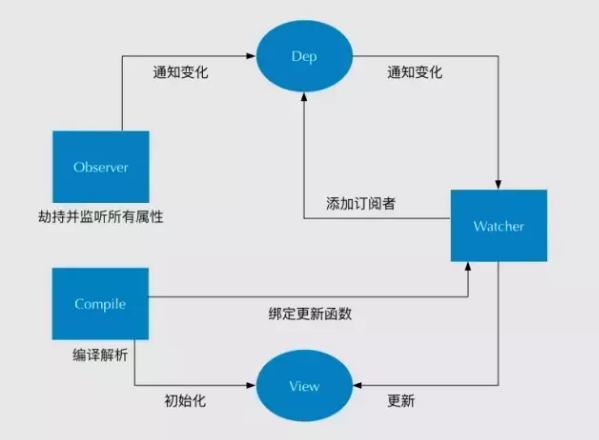
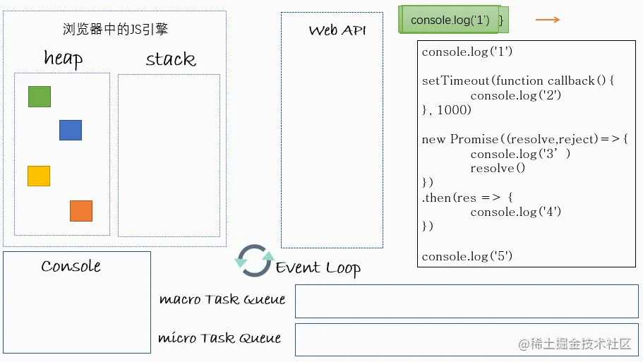
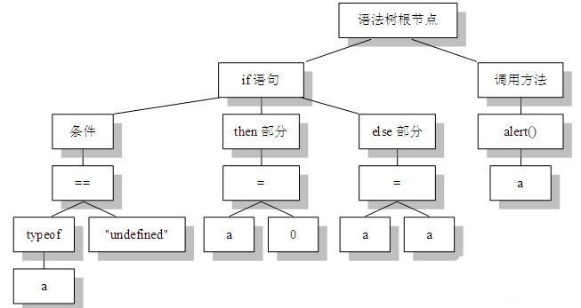

# 自我介绍

各位老师好，我现在就读于上海理工大学，目前研三，专业是电子信息，我应聘的岗位时前端开发。我最近大半年分别在上海城建信息科技、耀乘健康实习。

城建的领域主要是上海的一些轨道桥梁隧道等的数字化建设。我负责的前端开发，接触的项目主要有数字化大屏、手机app、后台管理项目。同时还整理一些技术文档。这些项目所使用的技术栈包括vue2、webpack、uniapp、sqlite。经常使用的是echarts、百度地图api、bmapgl\mapvgl、elementui、技术文档是使用vuepress搭建的。

耀乘的领域是医疗临床相关的软件产品。我负责的项目是一个临床实验的文档管理系统和组件库的开发维护。所使用的技术栈框架包括vue3、typescript、css使用tailwind、pnpm包管理工具、组件库使用的是基于primeVue二次封装开发的组件和vueUse的方法。协同办公方案是gitlab+jira+git。

这两家公司都给我带来了很大的帮助，如城建让我自学的前端技术都串起来，转化成能够用于实际生产生活的知识。在耀乘更多的学会一种规范化，让我在写代码的时候会去注意代码质量和复用性，和对于完全没有听说过的新框架新技术如何快速上手的能力。

除此之外，在研究生阶段，我曾参与过大大小小多个学校项目和竞赛，具有代表性是一个基于C#、mysql的制药设备的windows桌面软件开发和医疗机器人控制系统的研发。其中正是桌面软件的开发让我开始关注toCtoB的软件开发，只不过由于项目用的框架太过落后，为了走在主流了解到前端，学习前端、深入前端、明确了就业方向。

我的自我介绍完毕，谢谢。

# 项目介绍

## 1、app 巡视功能(城建)：

Uniapp 用户根据巡视作业单，完成巡视任务、上传缺陷，提交作业的功能

亮点：上报缺陷到提交缺陷之前这个过程是没有调用接口的，即新增、删除、编辑都需要在前端进行。这里使用了一个轻量化的数据库SQLite保存这些缺陷数据。

难点：不算难点，就是有点逻辑复杂。最后提交的缺陷是个根据多个分类条件、整理好的一个多层嵌套的对象。因此新增、删除、编辑都需要考虑缺陷的这些条件，是否重复、是否合理等。

解决：在写的时候尽可能多个函数模块编写，让所有条件、判断不要挤在少量几个函数中。保持逻辑清晰，容易定位维护。

整体：写了1600/1700行，基本没什么bug、且分模块编写，容易维护

> 是一个巡视功能。首先展示巡视作业单，存在待分配和待处理两个列表，先分配作业单，然后该作业单会出现在待处理列表中。然后点击某个待处理作业单查看其详情，该作业单下可以多次新增缺陷，缺陷页中给出若干的缺陷的选项，如负责人、日期、线路、巡视项、设备、缺陷图片及详情等。保存该缺陷后回到作业详情页会在其对于的每条线路下看到各自巡视项的缺陷和缺陷数量。点击缺陷项可以看到新增缺陷列表，每个缺陷都可以再次编辑和删除。最后所有缺陷填写编辑完成之后，在作业详情页提交报缺。
>
> 这个比较完整的功能，除了一开始的获取作业单列表，以及新增缺陷的各个选项是从后端接口获取，保存、编辑、删除等都是没有调用接口的。这也意味着最后提交给后端的是：包括多条线路下，多个巡视项下的不同缺陷的大json。这个大json在提交之前被保存在一个轻量的数据库SQLite中，该数据库也完全由前端进行控制。
>
> 除此之外，由于新增缺陷页的每个选项之间都存在着关系，如巡视项必须在选择好线路的情况下才能选择，设备设施必须在选择好巡视项的情况下选择等等。且每个缺陷之间也存在关系，如不能添加相同的某类型巡视项，不能添加相同的设备等等。那么除了页面上需要做提示，数据保存到sqlite之前也都做很多判断。
>
> 因此，这个需求的主要难点在于两点：一个、各个数据之间逻辑关系过多且复杂，其次、大json嵌套层数过深。主要的技术难点，使用以前从未使用的sqlite, 并且也是第一次在企业中使用uniapp开发安卓app。整个开发过程用了大概三个周，前面两三周集中精力写代码写逻辑，最后一周产品测试，修改一些bug。加上注释空格样式啥的，差不多1600/1700不到2000行的代码，反正我们领导说挺快的。
>
> 这个项目中，主要满意的是，我编写的时候有意识逻辑分模块编写。这不仅使上测服后测出的bug不多，且bug也能快速找到问题所在然后解决，对后期的维护起到了很大的帮助。个人感觉这边的代码写的是很漂亮的。
>
> 遇到的bug，举例一个：删除功能中，缺陷列表有多个缺陷时，删除其中一个，页面会只剩下一个缺陷。这边其实看起来是删除或者缺陷列表页的bug，其实问题出在作业详情页，因为缺陷列表的数据是详情页发送来的。这边的bug我虽然很快就找到了，但是如果是别人修改的话，没了解整体的编写逻辑，可能会一开始就走错方向。

## 2、点击空白处取消选择(耀乘)

大盒子里面有若干个可以被选中的小盒子，点击小盒子以外的部分会取消选择当前选中的盒子

刚开始写的时候，想着是判断点击事件的点击的node。

后来转换思路，用了点击事件冒泡的思路：大盒子绑定点击事件，小盒子阻止冒泡

## 3、无限滚动（耀乘）

场景：多级菜单，每级下的元素可能数据过多，使用无限滚动翻页

用的vueuse的useInfiniteScroll方法

不难，就是踩了很多坑

1、刚开始使用多级menu组件，但是组件封装的缘故，内层检测不到滚动事件，无法使用useInfiniteScroll===》手写外层盒子

2、手写最外层菜单，但是多层循环的内层循环的盒子也无法使用useInfiniteScroll ===》内层盒子封装组件里，然后组件里使用useInfiniteScroll

# 学习过程


# 面经

## 一、HTML、CSS
### em和rem适配

Rem 根据根元素(html元素)字体大小决定（css3）

Em 根据父元素字体大小 1em = 16px

rem是为了克服em的缺点而存在，只需要更改根元素字体大小

em的缺点：父元素的字体大小发生变化，em全部重新计算

### css单位px/em/rem/vh/vw/%

除了上面以外，vmin/vmax/ex/ch

px是绝对单位，不受其他因素的影响

其他都是相对单位

em相对父元素，未设置默认为16px=1em

rem相对根元素html

%相对父元素的宽度和高度

vh/vm相对窗口宽度/高度（web视窗,移动端布局视窗）

> 缺点：vw、vh依赖于视图窗口，故当屏幕分辨率变大或者缩小，尺寸会进行相应的放大或者缩小，当页面足够大，或者足够小时，尺寸会变得很大或者很小，从而导致用户体验差


### bootstrap框架实现适配

bootstrap布局 响应式布局设计、移动设备优先

```html
//引用
<meta name="viewport" content="width=device-width, initial-scale=1">
```

```css
//使用
@media(min-width:@screen-sm-min){...}小屏幕（平板，大于等于768px）
@media(min-width:@screen-md-min){...}中等屏幕（桌面显示器，大于等于992px）
@media(min-width:@screen-lg-min){...}大屏幕（大桌面显示器，大于等于1200px）

@media screen and (max-width:775px){适配一般手机}
@media screen and （min-width:768px）and (max-width:986px){适配ipad}
@media screen and (min-width：986px) and (max-width:1024px){适配ipad pro}
@media screen and (min-width:600px) and (max-width:986px){适配iphone}
```

```javascript
//js使用
window.onload = function() {
	// 动态获取界面宽度 设置根节点字体大小
    document.getElementsByTagName('html')[0].style.fontSize = document.body.clientWidth/100 + "px";
}
window.onresize = function() {
	// 动态获取界面宽度 设置根节点字体大小
    document.getElementsByTagName('html')[0].style.fontSize = document.body.clientWidth/100 + "px";
}

var ua = navigator.userAgent.toLowerCase();
            if(/phone|ipad|ipod/.test(ua)){
                console.log("是ipad设备");
                $(".sub_company_comments").css("writing-mode","vertical-lr");
                
            }else{
                console.log("不是ipad设备")
            }

```
### css清除浮动

- ###### 浮动工作原理

脱离标准流，不占据空间（引起高度坍陷现象）

碰到包含他的边框，或其他浮动元素停留。（依次横向排列，环绕文字）

- ###### 高度塌陷

容器高度  < 浮动元素高度

- ###### 清除浮动的理由

没有设定高度的容器，其中的元素被设置浮动，元素无法撑开容器。

元素会溢出到容器外（浮动溢出）

- ###### 清除浮动的方法

1、父级添加固定高度

2、最后一个浮动元素后面，添加一个空盒子并添加样式 clear: both

```css
.item{folat: left;}
.item_lastdiv{clear: both}
```

3、父级添加 overflow: hidden 或者 overflow: auto

触发BFC

4、使用:after伪元素（推荐使用）

```css
//clearfix是父盒子
.clearfix:after{
    content: "\2000";
    display: table;
    height: 0;
    clear: both;
}
.clearfix{
    *zoom: 1; //版本很低时需要添加此句
}
```

5、:after和:before伪元素

```css
.clearfix:after,.clearfix:before{
    content: "";
    display: table;
}
.clearfix:after{
    clear: both;
}
.clearfix{
    *zoom: 1;//版本很低时需要添加此句
}
```
### css三角形


```css
/* 三角形 */
.triangle1 {
    /* border盒子无大小时，是每个角的边框*/
    width: 0px;
    height: 0px;
    border: 50px solid transparent;
    border-bottom-color: orange;
}

.triangle2 {
    width: 0px;
    height: 0px;
    border-bottom: 100px solid orange;
    border-left: 50px solid transparent;
    border-right: 50px solid transparent;
}

.triangle3 {
    width: 0px;
    height: 0px;
    border: 50px solid transparent;
    border-top-color: orange;
}
```

### 重排（回流, layout）和重绘（painting）

Layout: 布局引擎计算盒子在页面上的大小/位置

Painting: 根据大小/位置/属性绘制每个盒子

#### 触发layout:

- 添加或删除可见的DOM元素

- 元素的位置发生变化

- 元素的尺寸发生变化（包括外边距、内边框、边框大小、高度和宽度等）

- 内容发生变化，比如文本变化或图片被另一个不同尺寸的图片所替代

- 页面一开始渲染的时候（这避免不了）

- 浏览器的窗口尺寸变化（因为回流是根据视口的大小来计算元素的位置和大小的）

- 获取一些特定属性的值

  > offsetTop、offsetLeft、 offsetWidth、offsetHeight、scrollTop、scrollLeft、scrollWidth、scrollHeight、clientTop、clientLeft、clientWidth、clientHeight、getComputedStyle

#### 触发painting:

- 触发回流一定会触发重绘

- 颜色的修改
- 文本方向的修改
- 阴影的修改

#### 避免layout的方法

- 如果想设定元素的样式，通过改变元素的 `class` 类名 (尽可能在 DOM 树的最里层)
- 避免设置多项内联样式
- 应用元素的动画，使用 `position` 属性的 `fixed` 值或 `absolute` 值(如前文示例所提)
- 避免使用 `table` 布局，`table` 中每个元素的大小以及内容的改动，都会导致整个 `table` 的重新计算
- 对于那些复杂的动画，对其设置 `position: fixed/absolute`，尽可能地使元素脱离文档流，从而减少对其他元素的影响
- 使用css3硬件加速，可以让`transform`、`opacity`、`filters`这些动画不会引起回流重绘
- 避免使用 CSS 的 `JavaScript` 表达式

### css隐藏元素的方法

1、`display:none;`

> 不占据空间，无法点击

2、`opacity:0;`

> 占据空间，可以点击

3、`visibility:hidden;`

> 占据空间，无法点击

4、`transform: scale(0,0)`

> 占据空间，无法点击

5、`position:absolute;   z-index:-1000;`

> 不占据空间，无法点击

6、

```css
.hide{    
  position：absolute;    
  left:-99999px;    
  top:-90999px;/* 不占据空间，无法点击 */ 
} 
.hide-2{    
  position：relative;    
  left:-99999px;    
  top:-90999px;/* 占据空间，无法点击 */ 
}
```

7、`overflow:hidden;`

> 占据空间，无法点击

### 设置12px以下的字体

1、`zoom:0.5`

2、`-webkit-transform:scale(0.5);`

> 缩小一半

3、`-webkit-text-size-adjust:none`

> 浏览器不自动调整大小，只适用英文字体

### 设置0.5px的边框

1、scale+伪元素

```html
<div class="half-1px-border">四周0.5px</div>
```

```css
.half-1px-border {
        position: relative;
      }
.half-1px-border::after{
            content         : '';
            position        : absolute;
            width           : 200%;
            height          : 200%;
            top             : 0;
            left            : 0;
            transform-origin: 0 0;
            border-width    : 1px;
            border-style    : solid;
            transform       : scale(0.5, 0.5);
            border-radius   : 1px;
            box-sizing      : border-box;
            pointer-events  : none;
        }
```

2、svg画一个

```html
<object
        style="margin: auto"
        data="./halfborder.svg"
        type="image/svg+xml"
      />
```

```html
halfborder.svg
<svg xmlns='http://www.w3.org/2000/svg' width='100%' height='1px'>
    <line x1='0' y1='0' x2='100%' y2='0' stroke='#000'></line>
</svg>
```

## 二、综合功能

### 渲染大量图表

思路：增强计算能力、减少计算量

1、worker多线程

2、懒加载

3、降采样

### 懒加载实现

懒加载即延迟加载，页面没有滑到可视区域不加载，（有点像异步组件）

图片预加载，先加载图片，与懒加载刚好相反

懒加载适用场景：图片多、页面很长

###### 实现原理：

src赋空字符串，将实际值放入data-original中，根据scroll事件的回调判断是否被滑到可视区域，在可视区域则将data-original的值复制给src。

###### 原生js:

```html
    <html lang="en">
    <head>
        <meta charset="UTF-8">
        <title>Lazyload</title>
        <style>
          .image-item {
    	    display: block;
    	    margin-bottom: 50px;
    	    height: 200px;//一定记得设置图片高度
    	}
        </style>
    </head>
    <body>
    
    
    
    
    
    
    
    
    
    
    
    
    <script>
    var viewHeight =document.documentElement.clientHeight//获取可视区高度
    function lazyload(){
    var eles=document.querySelectorAll（'img[data-original][lazyload]'）
    Array.prototype.forEach.call(eles,function(item,index){
    var rect
    if(item.dataset.original==="")
       return
    rect=item.getBoundingClientRect()// 用于获得页面中某个元素的左，上，右和下分别相对浏览器视窗的位置
    if(rect.bottom>=0 && rect.top < viewHeight){
    !function(){
      var img=new Image()
      img.src=item.dataset.url
      img.onload=function(){
        item.src=img.src
        }
    item.removeAttribute（"data-original"）//移除属性，下次不再遍历
    item.removeAttribute（"lazyload"）
       }()
      }
     })
    }
    lazyload()//刚开始还没滚动屏幕时，要先触发一次函数，初始化首页的页面图片
    document.addEventListener（"scroll"，lazyload)
    </script>
    </body>
    </html>
```

## 三、JavaScript

### 数据类型

**null 和 undefined 区别**

都是基本数据类型、都只有一个值

undefined 未定义 变量未被赋值的情况

null 空对象 赋值给一些可能返回对象的变量

```js
undefined === null //false
undefined == null //true
```

**NaN**  ： not a number 不是一个数字

用于指出数字类型中的错误情况，即执行数学运算没有成功，这是失败后返回的结果

```js
Typeof NaN // 'Number'
Object.is(NaN, NaN); // true
NaN === NaN // false
NaN !== NaN // true
Number.isNaN("NaN");      // false，字符串 "NaN" 不会被隐式转换成数字 NaN。
Number.isNaN(undefined);  // false
Number.isNaN({});         // false
Number.isNaN("blabla");   // false
```

### 数据类型判断

#### typeof

```js
typeof {a:1}  //object
typeof function(){} //function
```

其中 数组[]、对象{}、null 都会被判断为object   但是function可以检测出来

#### intanceof 

内部运行机制：判断在其原型链中能否找到该类型的原型

只能正确判断引用数据类型（<Array>[] <Object>{} <Function>function(){}）

```js
[] instanceof Array  //true
```

基本数据类型判断，数据必须是new出来的

```js
"abc" instanceof String   //false

var name = new String("abc");
name instanceof String;  //true
```


可以用来测试一个对象在原型链中是否存在一个构造函数的prototype属性

#### constructor 

```js
//(数据值).constructor === 数据类型
(2).constructor === Number  //true
```

两个作用：判断数据类型、对象实例通过constrcutor 对象访问它的构造函数

举例：

```js
function fn(){} // 构造函数
fn.prototype = new Array(); //构造函数的原型改成数组
var f = new fn(); //f 为对象实例
f.constructor === fn; //false
f.constructor === Array; //true
```

#### prototype

```js
//Object.prototype.toString.call(数据值)
Object.prototype.toString.call('abc') //'[object String]'
```

### 判断数组的方式

#### prototype

```js
Object.prototype.toString.call(待判断数据).slice(8,-1) === 'Array'  //取'[object String]'中空格后面的字符
```

#### proto

```js
待判断数据.__proto__ === Array.prototype
```

#### isArray

```js
Array.isArray(待判断数据)
```

#### instanceof 

```js
待判断数据 instanceof Array
```

#### isPrototypeOf

```js
Array.prototype.isPrototypeOf(待判断数据)
```


### 防抖节流说一下

#### 防抖：

对与高频触发的事件（如input输入）进行n秒延迟响应

实现思路：每次触发事件，检查是否有定时器正在计时，有则不执行且重新计时，没有则执行

```javascript
function debounce(fn,delay=500){
    //timer写在闭包中
    let timer = null;

    return function(){
        //定时器还在计时，0.5秒还没到，删除定时器
        if(timer){
            console.log('还在计时');
            clearTimeout(timer)
        }
        //定时器没有在计时
        // 新建定时器，计时结束调用事件函数，清空定时器
        //延迟函数回调写成箭头函数，this指向是debounce的this指向dom
        //          写成function函数，this指向是定时器的this指向window
        timer = setTimeout(()=>{
            // this指向改为fn的this
            fn.apply(this,arguments);
            timer = null;
        },delay)
    }
}

function fn(){
    console.log('发送请求：防抖实现');
}

const input = document.querySelector('input');
input.addEventListener('keyup',debounce(fn,1000));
//debounce(fn,1000)返回一个函数对象，此函数是keyup的回调函数
```

#### 节流：

触发事件后，对应的操作根据时间间隔执行。以降低操作的频率（冷却）

实现思路：触发事件，检查是否有定时器，有则不执行，没有则执行

```javascript
//定时器写法
function throttle(fn, delay = 2000) {
    let timer = null;
    return function () {
        if (timer) {
            return
        }
        //计时
        timer = setTimeout(() => {
            fn.apply(this, arguments);
            timer = null
        }, delay)
    }
}

div.addEventListener('drag', throttle(function (e) {
    console.log(e.offsetX, e.offsetY)
}, 200))

//时间戳写法
function throttleTP(fn, delay = 2000) {
    let lastTime = 0 //上次放大招的时刻
    return function () {
        var now = Date.now();
        var cooling = now - lastTime < delay
        //第一次按下时，cooling = now-0 > delay
        //正在冷却，true无法放大招
        if (cooling) {

            return;
        }
        //没有正在冷却
        lastTime = Date.now();
        //放大招
        fn.apply(this, arguments);
    }
}
button.addEventListener('click', throttleTP(function () {
    console.log('放大招')
}, 2000))
```

#### 结合防抖和节流

触发事件后，先冷却后防抖

```javascript
//滚动条
//防抖：避免高频操作，对服务器的压力
//节流：防止应为防抖函数，而不提交任何申请
function combineDe_Th(fn, delay = 500, wait = 2000) {
    var lastTime = 0;
    var timer_debounce = null;
    var timer_throttle = null;

    //响应事件
    const reaction = function (...args) {
        clearTimeout(timer_debounce);
        clearTimeout(timer_throttle);
        lastTime = Date.now();
        fn.apply(this, args);
        timer_debounce = null;
        timer_throttle = null;
    }
    return function () {
        var now = Date.now();
        var cooling = now - lastTime < wait;

        //每次触发事件，都将防抖计时清除，重新防抖计时
        clearTimeout(timer_debounce);

        // 冷却时间到了，重新节流计时
        if (!cooling && !timer_throttle) {
            //节流
            timer_throttle = setTimeout(reaction, wait, 'throttle', ...arguments)
        } else {
            //内存中存在节流计时器（还在冷却）
            //每次触发事件，重新防抖计时
            //防抖
            timer_debounce = setTimeout(reaction, delay, 'debounce', ...arguments)

        }
        //只有当内存中没有任何计时器时，才会触发事件，即冷却结束（由于每次触发事件都会清除防抖计时，所以冷却结束时，一定防抖结束）

    }
}
const span = document.querySelector('span');
span.addEventListener('scroll',combineDe_Th(function(){
    console.log('响应')
}))

```

### js实现倒计时？2种办法

```javascript
//计数器
let timer = null
function seconds(sec){
        // 倒计时十秒
        canAgain.value = `重新发送${sec}秒`
        let time = sec//倒计时的数字
        // 清除定时器
        clearInterval(timer)
  			//1秒的计数器
        timer = setInterval(()=>{
            time--
            if(time>0){
                canAgain.value = `重新发送${time}秒`
            }else{
              //10次计数器，时间到
                clearInterval(timer)
                time = sec
                canAgain.value = '重新发送'
            }
        },1000)
    }
}
seconds(10)
```

```html
//定时器
<script type="text/javascript">
    function daojishi()
    {
        var starttime=document.getElementById("id2").innerText;
        if(starttime==0)
        {
            return ;
        }
      //递归
        setTimeout("daojishi()",1000);
        starttime--;
        document.getElementById("id2").innerText=starttime;
    }
</script>

<body>
<h5 id="id2">10</h5>
<button id="id1" onclick="daojishi()">开始倒计时</button>
</body>

```

### class继承、组合继承和寄生组合继承？区别？其他继承？

class 是 面对对象方法的语法糖

class 之前，实现面对对象：在原型链上添加一个对象，需要使用函数的形式，在其原型上添加方法和属性，然后通过new 来创建实例

```js
//创建一个对象
function User(name){
    this.name = name;
}
//在对象的原型上添加一个方法
User.prototype.show = function(){
    console.log('hi,'+this.name)
}
//new 一个实例
let user = new User('jone');
//此实例 具有 show 方法
user.show();//hi,jone
```

class之后，使用类的方法

```js
class User{
  constructor(name){
  		this.name = name;
  }
  show(){
 			console.log('hi,'+this.name);
  }
}
let user = new User('jone');
user.show();
```

###### 组合继承：伪经典继承

将原型链和借用构造函数的技术组合到一块

原理：使用原型链实现对原型属性和方法的继承,而通过借用构造函数来实现对实例属性的继承

既通过在原型上定义方法实现了函数复用，又能够保证每个实例都有它自己的属性。

***儿子想要爹的东西，但是儿子的东西又不想给爹，所以爹就把自己的东西放在实例对象的 篮子 里 给儿子，再把儿子原来有的东西放进去 儿子去爹的篮子拿，东西也往里面放。***

缺点：会调用两次父类构造函数的代码

```js
Son.prototype = new Father()
Son.prototype.constructor = Son
```

```js
function Person(name){
  this.name=name;
}
Person.prototype.sayName=function(){
  console.log(this.name+' '+this.gender+' '+this.age);
}
function Female(name,gender,age){
  Person.call(this,name);//第一次调用父类构造函数             
  this.age=age;
  this.gender=gender;
}
Female.prototype=new Person();//第二次调用父类构造函数
Female.prototype.constrcutor=Female;//因重写原型而失去constructor属性，所以要对constrcutor重新赋值

```

###### 寄生组合式继承

通过借用构造函数来继承属性，通过原型链的方式来继承方法

```js
//属性
function inheritPrototype(Female,Person){ 
  var protoType=Object.create(Person.prototype);
  protoType.constructor=Female;
  Female.prototype=protoType;
}
inheritPrototype(Female,Person);
//取代
//Female.prototype=new Person();
//Female.prototype.constrcutor=Female
```

```js
//方法
Female.prototype.sayAge=function(){
	console.log(this.name+' '+this.age);
}
var fm=new Female('skila','female',19);
fm.sayName();//skila female 19
fm.sayAge();//skila  19
```

###### 区别

组合继承：原型链实现方法和属性继承，然后重新补足丢失的构造函数，两次调用父类构造函数

寄生组合式继承：构造函数继承属性，原型链继承方法

###### 其他继承

- 原型链继承
- 借用构造函数继承
- 组合模式继承
- 共享原型继承
- 原型式继承
- 寄生式继承
- 寄生组合式继承
- ES6 中 class 的继承（新）

### Proxy

代理，能够拦截对象的操作，修改操作的默认行为（元编程，对编程语言编程），并返回新的对象。

```js
//arr = [1,2,3,4]
// 目标：arr[-1]//4

const createArr = (...elements)=> {
    const target = [...elements]
    return new Proxy(target,{
        get:function(target,key,receiver){
            let index = Number(key)
            if(key<0){
                key=String(index+target.length) 
            }
            return Reflect.get(target,key,receiver)
        }
    })
}
const arr = createArr(1,2,3,4)
console.log(arr[-1]);//4
arr.push(5)
console.log(arr[-1]);//5
```

**Reflect也ES6新增类，在这里的作用为：**

- 只要`Proxy`对象具有的代理方法，`Reflect`对象全部具有，以静态方法的形式存在
- 修改某些`Object`方法的返回结果，让其变得更合理（定义不存在属性行为的时候不报错而是返回`false`）
- 让`Object`操作都变成函数行为

**proxy可以拦截很多对象操作，这里举例的get为获取对象的值：**

- get(target,propKey,receiver)：拦截对象属性的读取
- set(target,propKey,value,receiver)：拦截对象属性的设置
- has(target,propKey)：拦截`propKey in proxy`的操作，返回一个布尔值
- deleteProperty(target,propKey)：拦截`delete proxy[propKey]`的操作，返回一个布尔值
- ownKeys(target)：拦截`Object.keys(proxy)`、`for...in`等循环，返回一个数组
- getOwnPropertyDescriptor(target, propKey)：拦截`Object.getOwnPropertyDescriptor(proxy, propKey)`，返回属性的描述对象
- defineProperty(target, propKey, propDesc)：拦截`Object.defineProperty(proxy, propKey, propDesc）`，返回一个布尔值
- preventExtensions(target)：拦截`Object.preventExtensions(proxy)`，返回一个布尔值
- getPrototypeOf(target)：拦截`Object.getPrototypeOf(proxy)`，返回一个对象
- isExtensible(target)：拦截`Object.isExtensible(proxy)`，返回一个布尔值
- setPrototypeOf(target, proto)：拦截`Object.setPrototypeOf(proxy, proto)`，返回一个布尔值
- apply(target, object, args)：拦截 Proxy 实例作为函数调用的操作
- construct(target, args)：拦截 Proxy 实例作为构造函数调用的操作


### promise

promise是异步操作的容器

三个promise状态：进行中（pending）、已完成（resolved）、已拒绝（rejected）

一个事件成为promise对象，此时状态为pending 、完成后变成resolved \被拒绝变成rejected。

一旦完成/拒绝，状态不会再改变

#### 状态变化

Pending --> fulfilled(resolved)

Pending --> rejected(rejected)

```js
//完成的参数为拒绝==》结果为拒绝
var p = new Promise((resolve, reject) => {
    resolve(Promise.reject('failed'));//处理Promise.reject('failed')
});

p.then((val)=>{
console.log(val,'1')
},(val)=>{
    console.log(val,'2')
})//failed 2
```

```js
//拒绝的参数为完成==》结果仍然为拒绝
var promise = new Promise((resolve, reject) => {
    reject(Promise.resolve('success'));//因为Promise.resolve('success')拒绝
});
promise.then((val) => {
    console.log(val,'1');
}, (val) => {
    console.log(val,'2');
});//Promise { 'success' } 2
```

**解释：**

resolve(val) 执行结束前状态pending 

​	处理val, 处理结果反应状态变化，如果状态为resolved就执行then()的第一个回调，反之状态为rejected,执行第二个回调

reject(reason)以reason为理由拒绝，结果已经是rejected

#### 并行执行两个异步操作All

```js
const promises = []
for(let request of requests){ promises.push(request) }
Promise.all(promises).then(res => /*res[0], res[1]*/)
```

#### 一直处于pending造成内存泄漏

Promise一旦创建是无法取消的，本质上，Promise是无法被终止的。它永远会等待结果的返回。

需要我们自己保证promise并不会一直pending，导致内存无法释放

### 深浅拷贝？实现？

针对对象：应用数据类型

浅拷贝：复制地址（栈中），内容指向同一堆。直接复制

深拷贝：开辟新的堆，复制内容

###### 实现：

```js
// 深拷贝的方法
// 1、json 方法
const copyObj = JSON.parse(JSON.stringify(obj))

// 2、递归
function deepClone(obj = {}) {
    if (typeof obj != 'object' || obj == null) {
        return obj
    }
    let res;
    // instanceof: 检测array.prototype 属性是否在obj的原型链上
    //=====>if(Array.isArray(obj))
    if (obj instanceof Array) {
        res = [];
    } else {
        res = {};
    }

    for (let key in obj) {
        //hasOwnProperty:检测obj自身是否有key属性，且不是原型链继承而来
        if (obj.hasOwnProperty(key)) {
            //是就赋值，并再次检测key属性值是否为对象、数组类型
            res[key] = deepClone(obj[key])//递归
        }
    }
    return res;
}
```

#### json方法的缺点

1、原对象中有**时间类型**，拷贝后的只是字符串

2、原对象中有**error、regexp类型**，拷贝后为空对象null

3、原对象中有**函数、undefined类型**，拷贝后丢失

4、原对象中有**由函数生成的对象**，拷贝后构造函数constructor丢失

5、原对象中**有循环引用的情况**，也无法正确拷贝


### js原型链和原型

原型：类有显式原型prototype, 实例有隐式原型-proto-, 

​			实例的原型指向 类的原型==》`person.__proto__ === Person.prototype `

原型链：当访问一个对象属性时，没有就去原型对象找该属性，该原型对象也有自己的原型，这样就形成了原型链

构造函数：当一个普通函数创建一个类对象是，那么就称它为构造函数

使用：构造函数创建新类，并添加属性，原型方法添加类的方法和属性，然后通过new 来创建实例

```js
//创建一个对象
//构造函数
function User(name){
    this.name = name;
}
//在对象的原型上添加一个方法
User.prototype.show = function(){
    console.log('hi,'+this.name)
}
//new 一个实例
let user = new User('jone');
//此实例 具有 show 方法
user.show();//hi,jone
```

### ES6新特性

#### Symbol

自定义独一无二的值，不能使用new创建

```js
var sy = Symbol('test');
var sy1 = Symbol('test');
console.log(tepeof sy);   //'symbol'
sy == sy1;   //false
var sy2 = new Symbol('test');   //error : Symbol is not a constructor
```

#### let 和 const

Let 不能重复声明、不能变量提升、块状作用域{}、不属于顶层对象（window「浏览器」、global「node」）

var 函数作用域function(){}、属于顶层对象（window.**可以访问到）、没有暂时性死区（没声明也可以使用）

Const 必须设置初始值，不可以重复赋值、但是能改变其属性（只能保证变量指针不变）

|           特性           |  Var   |  Let   | Const  |
| :----------------------: | :----: | :----: | :----: |
|        块级作用域        |        | :boom: | :boom: |
|         变量提升         | :boom: |        |        |
| 属于顶层对象（全局属性） | :boom: |        |        |
|         重复声明         | :boom: |        |        |
|        暂时性死区        |        | :boom: | :boom: |
|        设置初始值        |        |        | :boom: |
|     可以改变指针方向     | :boom: | :boom: |        |

#### 解构赋值

```js
let [a,b,c] = [1,2,3];
console.log(a,b,c);    //1,2,3
 
let [a,b,c] = [1,,3];
console.log(a,b,c);    //1,undefined,3
 
let [a,,b] = [1,2,3];
console.log(a,b);//1,3
 
let [a,..b] = [1,2,3];    //...是剩余运算符，表示赋值运算符右边除第一个值外剩余的都赋值给b
console.log(a,b);//1,[2,3]
```

```js
let arr = 'hello';
let [a,b,c,d,e] = arr;
console.log(a,b,c,d,e);  //'h','e','l','l','o'
```

```js
let obj = {name:'ren',age:12,sex:'male'};
let {name,age,sex} = obj;
console.log(name,age,sex);  //'ren' 12 'male'
let {name:myName,age:myAge,sex:mySex} = obj;  //自定义变量名
console.log(myName,myAge,mySex);  //'ren' 12 'male'
```

#### Map和Set

#### Proxy

#### Promise

对象新特性

字符串新方法

#### 数组新方法

##### ES6前：

1、数组转字符串  toString()  toLocalString()  join()（可以自定义连接符）

2、数组尾部操作  pop() push()

3、数组首部操作  shift()删除 unshift()添加

4、重排序        reverse() sort()

5、数组连接      concat()

6、数组截取      slice()

7、插入          splice()

8、查找          indexOf()  lastIndexOf()

9、迭代方法       every()  some()  filter()  map()   forEach()

some判断数组是否满足某条件，有满足的返回true,  都不满足才返回false

every作用同上，但是只有全部满足才返回true

10、归并/递归      reduce()  reduceRight() 

##### ES6新增的数组方法：

###### 1、Array.from(arraylike)

```js
let people={
    0:'zhangsan', 
    '1':24,     //key值必须是0,1,2......可以是数字或者字符串
    length:2    //必须有length这个特殊的属性
};
let trans=Array.from(people);//Array.from()方法
console.log(trans); //['zhangsan',24]
```

###### 2、Array.of()

```js
let arr =Array.of(3,4,5,'zhang','li');
console.log(arr);  //[3, 4, 5, "zhang","li"]
```

######  3、find((item)=>条件).   findIndex()

找到就停止

find未找到返回undefined；findIndex未找到返回-1

###### 4、fill(val,start,end) 

第一个参数是填充的变量，第二个是开始填充的位置，第三个是填充到的位置

```js
let arr=[0,1,2,3,4,5,6,7,8,9];
arr.fill('javascript',2,4);
console.log(arr);//[0, 1, "javascript", "javascript", 4, 5, 6, 7, 8, 9]
```

###### 5、for-of  item

```js
 let arr=['js','java','python','c','c++'];
 for (let item of arr){
    console.log(item);//j java python c c++
}
```

###### 6、键、值、键值

- arr.keys()方法是对key值得遍历
- arr.values()方法是对value值的遍历
- arr.entries()方法是对键值对的遍历

```js
const arr = ['js','css','html']
const list = arr.entries()
console.log(list.next().value);
console.log(list.next().value);
console.log(list.next().value);
[ 0, 'js' ]
[ 1, 'css' ]
[ 2, 'html' ]
```

```js
for(let item of list){
    console.log(item);
}
```

###### 7、copyWithin(change,start,end)

内部的数据复制并替换到某个位置

- 第一个参数（从该位置开始替换数据）；
- 第二个参数（可选 从该位置开始读取数据，默认为0，负值表示倒数）；
- 第三个参数（可选 到该位置前停止读取，默认为数组长度）

```js
[1, 2, 3, 4, 5].copyWithin(0, 3) // [4, 5, 3, 4, 5]
```

###### 8、includes()

- 第一个参数必选（待检查的给定值）
- 第二个参数可选，表示搜索的起始位置，默认为0，负数表示倒数的位置

和indexOf的区别，indexOf进行了运算符的强比对，会导致对NaN误判。

```js
[1, 2, 3].includes(2);     // true
[1, 2, 3].includes(4);     // false
[1, 2, NaN].includes(NaN); // true
```

参数默认值

#### 箭头函数

()=>{} 没有prototype 、 没有自己的this 指向 、 不可以使用arguments参数

##### 箭头函数与普通函数的区别

1、箭头函数更加简洁

```js
()=>{}
(a)=>
a=>
a,b=>
()=> return a
()=> void doesNotReturn();//没有返回值的情况
```

2、箭头函数没有自己的 this

​    继承自己作用域的上一层this ，且在定义时就已经确定了，之后不会改变

3、箭头函数继承来的THIS指向不会改变

4、call() apply() bind() 等方法无法改变箭头函数的this指向

5、箭头函数无法作为构造函数使用

6、箭头函数没有自己的arguments  使用上一级作用域的argument属性值

7、箭头函数没有prototype

8、箭头函数不能作为 generator 函数（生成器），不能使用yeild关键字

- class类
- 模块导入导出
- promise
- Generator


### js数据类型?精度丢失

#### 精度丢失：0.1+0.2 != 0.3

```js
0.1 + 0.2  //0.30000000000000004
```

**原因：**

二进制求和

0.1 + 0.2 ==》 0.0001100110011001100…… + 0.001100110011…… 

其二进制都是无线循环的数

js中数字型都是double型（双精度浮点型），小数部分最多保留52位（二进制）

**解决方法：**

1、0.1+0.2

```js
(0.1+0.2).toFixed(2)  //'0.30'
//tofixed(num) 是四舍五入 ,num 为指定小数点位数
```

2、0.1+0.2===0.3//false

```js
function numberEpsilon(arg1,arg2){
    return Math.abs(arg1 - arg2) < Number.EPSILON;
}
numberEpsilon(0.1+0.2,0.3); //true
//<误差范围（机器精度）>
//Number.EPSILON = 2 - 52 
```

### call apply bind

#### 比较

1、都用于改变this指向，（上下文content）

2、第一个参数都为 this指向的对象，当值为null/undefined时指向window

3、函数调用的参数放在第二参数中，apply第二个参数是数组形式，call/bind第二个参数直接逗号分开

4、apply/call() 返回函数调用值（改变指向并执行），bind() 返回函数（仅仅改变了指向），bind()() 才是调用函数

5、bind可以多次传参数

#### 使用

```js
const person ={
    name:'0',
    getName: function (){
        console.log(this.name,this,'person方法')
    }
}
person.getName()//this 为 person
```

```js
person.getName.apply(null)//this 为 window
```

```js
//由于下面的person.getName 作为回调函数，其作用域又变成全局，this指向window
setTimeout(person.getName,100) //this 为 window

//通过bind改变this指向，且bind()返回的是函数，刚好可以作为回调函数
setTimeout(person.getName.bind(person),100)//this 为 person
```

```js
function sayName(...args){
    console.log(this,...args,'sayname')
}

obj = {
    name :'0'
}
sayName(1,2)//this 为 window

//1、apply 参数[1,2]
sayName.apply(obj,[1,2])// this 为 obj

//2、call 参数1，2
sayName.call(obj,1,2)// this 为 obj

//3、bind 参数1，2，返回函数，且可以多次传递参数
sayName.bind(obj,1,2)//没有打印任何东西
console.log(sayName.bind(obj,1,2))//[Function: bound sayName]

const sayNameBind = sayName.bind(obj,1,2)
sayNameBind()//this 为 obj ==>{ name: '0' } 1 2 sayname
sayNameBind(3,4)//{ name: '0' } 1 2 3 4 sayname
```

#### 复现bind

```js
var obj = {
    myfun(city01,city02){
        console.log(this.name + '年龄' + this.age + '来自' + city01 + '去往' + city02); 
    }
}
var db = {
    name :'张三',
    age:99
}

Function.prototype.bind1 = function(){
    // arguments参数，
    //原来的参数变成数组
    const arguments1 = Array.prototype.slice.call(arguments)
    console.log(arguments1,'arguments1')//[ { name: '张三', age: 99 }, '上海', '拉萨' ]
    console.log(arguments,'arguments')// { '0': { name: '张三', age: 99 }, '1': '上海', '2': '拉萨' }
    console.log(this,'this') //[Function: myfun]

    //获得数组中第一个元素，决定了this指向的对象
    const t = arguments1.shift();//'0': { name: '张三', age: 99 }  ==> this 为 db
    //删除第一个参数
    console.log(arguments1,'arguments1')//[ '上海', '拉萨' ] arguments1

    const self = this; //self 为调用的函数

    return function(){
        return self.apply(t,arguments1)//myfun.apply(db,[ '上海', '拉萨' ])
    }
}

obj.myfun.bind1(db,'上海','拉萨')()//张三年龄99来自上海去往拉萨

//无法实现多次传参
obj.myfun.bind1(db)('上海','拉萨')//张三年龄99来自undefined去往undefined
```

修改上诉代码return 部分, 解决多次传参问题

```js
return function(){
  arguments1 = arguments1.concat(...arguments)
  console.log(arguments1,'secondarguments')//[ '上海', '拉萨' ]
  return self.apply(t,arguments1)//myfun.apply(db,[ '上海', '拉萨' ])
}
obj.myfun.bind1(db)('上海','拉萨')//张三年龄99来自上海去往拉萨
obj.myfun.bind1(db,'上海')('拉萨')//张三年龄99来自上海去往拉萨
```


## 四、Vue

### 响应式原理

**注意：响应式原理与双向绑定的区别**：

> 响应式原理是数据劫持+发布订阅
>
> 双向绑定是v-model，实现依赖响应式原理的

思路：监听数据变化，更新视图数据



原理：数据劫持+订阅发布

步骤：

**首先要对数据进行劫持监听，所以我们需要设置一个监听器Observer，用来监听所有属性。如果属性发上变化了，就需要告诉订阅者Watcher看是否需要更新。**

**因为订阅者是有很多个，所以我们需要有一个消息订阅器Dep来专门收集这些订阅者，然后在监听器Observer和订阅者Watcher之间进行统一管理**

**接着，我们还需要有一个指令解析器Compile，对每个节点元素进行扫描和解析，将相关指令对应初始化成一个订阅者Watcher，并替换模板数据或者绑定相应的函数，此时当订阅者Watcher接收到相应属性的变化，就会执行对应的更新函数，从而更新视图。**

编译解析和绑定事件compile

> {{value}}中的数据够在视图上展示，通过遍历正则node.childNode中{{}}, 然后用$data对应值代替 ，@click等时间绑定到addeventlister

>  解析并收集所有订阅者

数据劫持并监听变化observer

> 劫持$data中的变量，放到vue实例上，并使用Object.defineproperty给每个变量添加get/set, 这样实例上的变量和$data中的变量都会同时改变

> 劫持并监听数据

订阅更新视图Watcher

> 收集所有视图中调用的数据，监听到变化则update更新视图

> 更新视图

#### vue2与vue3数据劫持的原理区别

##### vue2使用Object.defineproperty

问题：

- 检测不到对象的添加和删除，为此vue2用了set,delete

- 检测不到数组API，为此重写了多个数组API
- 需要对每个属性进行遍历监听，如果嵌套对象，需要深层监听，造成性能问题

##### vue3使用proxy

- 直接可以劫持整个对象，并返回一个新对象，我们可以只操作新的对象达到响应式目的
- 可以直接监听数组的变化（`push`、`shift`、`splice`）
- 有多达13种拦截方法

### v-model

1、只能form表单中 
> Input type='text' 绑定的 value
>
> Input type='radio' 绑定的 value
>
> Input type='checkbox' 有value 绑定的 value; 无value 绑定 checked

2、v-bind+onchange 的语法糖写法 

<input v-model="searchText" />

```html
<input
  :value="searchText"
  @input="searchText = $event.target.value"
/>
```

3、组件v-model

<CustomInput v-model="searchText" />

```html
<CustomInput
  :modelValue="searchText"
  @update:modelValue="newValue => searchText = newValue"
/>
```

4、指定v-model

<MyComponent v-model:title="bookTitle" />

```html
<!-- MyComponent.vue -->
<script>
export default {
  props: ['title'],
  emits: ['update:title']
}
</script>

<template>
  <input
    type="text"
    :value="title"
    @input="$emit('update:title', $event.target.value)"
  />
</template>
```

5、绑定多个v-model

<UserName  v-model:first-name="first"  v-model:last-name="last" />

```html
<script>
export default {
  props: {
    firstName: String,
    lastName: String
  },
  emits: ['update:firstName', 'update:lastName']
}
</script>

<template>
  <input
    type="text"
    :value="firstName"
    @input="$emit('update:firstName', $event.target.value)"
  />
  <input
    type="text"
    :value="lastName"
    @input="$emit('update:lastName', $event.target.value)"
  />
</template>
```

6、v-model修饰符

> .trim 去掉首尾空格
>
> .number 变成number型
>
> .lazy onchange时更新数据
>
> [自定义修饰符](https://cn.vuejs.org/guide/components/v-model.html#handling-v-model-modifiers)

### v-if与v-for

**不能同时使用**

v-for**优先级更高**

> 每次都遍历一边，然后再判断，消耗过大，性能浪费

1、v-if 包裹 v-for

2、v-for内出现v-if可以用computed过滤掉不需要的元素

### v-if与v-show

V-show 使用**display**:**none**控制元素的可见性

v-if 直接操作dom，**直接删除**/**新建元素**

因此，

1、v-if 切换伴随 触发组件生命周期，监听事件的销毁/建立

2、v-if消耗性能，v-show消耗初始渲染

**使用场景：**

v-if条件变化频率低，v-show频繁切换

### slot插槽

#### 默认插槽

> 只能占个位，子组件标签内的内容会替代<slot/>，标签内没有没有内容则使用默认<slot>标签内的内容

```html
child.vue
<div>
	<slot/>< !-- 空占位 --! >
  <slot>默认卡片</slot>< !-- 带有默认卡片的占位 --! >
</div>

father.vue
<Child>
  <buttom>卡片</buttom>
</Child>
```

#### 具名插槽

> Slot name属性赋值，没有赋值的隐含name=default

```html
child.vue
<div class="container">
  <header>
    <slot name="header"></slot>
  </header>
  <main>
    <slot></slot>
  </main>
  <footer>
    <slot name="footer"></slot>
  </footer>
</div>

father.vue
<Child>
  <template v-slot:header>
    <h1>Here might be a page title</h1>
	</template>
</Child>
```

```html
两种写法
1、
<template #header>
    <h1>Here might be a page title</h1>
</template>
2、
<template v-slot:header>
    <h1>Here might be a page title</h1>
</template>
注意：只能是template上写v-slot
```

#### 作用域插槽

> 父组件可以调用子组件的数据

```html
Child.vue
<div>
  <slot :text="greetingMessage" :count="1"></slot>
</div>

father.vue
<Child v-slot='data'>
  {{data.text}}{{data.count}}
</Child>
```

#### 具名作用域插槽

> 具名+作用域

```html
child.vue
<div class="container">
  <header>
    <slot name="header" :message="msg"></slot>
  </header>
</div>

father.vue
<Child>
  <template #header={message}>
    <h1>{{message}}</h1>
	</template>
</Child>
```

### methods与computed比较

1、computed 不用调用

2、computed有缓存，数据发生变化时才会执行

3、computed可以使用get/set实现双向绑定，简单写法为单项绑定

```js
computed:{
// 采用get加set方式
  sumScore: {
    get: function () {
      console.log("compute的get方式调用");
      return (this.mathScore - 0) + (this.englishScore - 0);
    },
      // 当在输入框中更改了总分后，两项成绩就会分别取到新总分的平均值，从而实现双向绑定
    set: function (newValue) {
        console.log("compute的set方式调用");
        var avgScore = newValue / 2;
        this.mathScore = avgScore;
        this.englishScore = avgScore;
      }
  }
}
```

### Option API与composition API比较

- 在逻辑组织和逻辑复用方面，`Composition API`是优于`Options API`

- 因为`Composition API`几乎是函数，会有更好的类型推断。

- `Composition API`对 `tree-shaking` 友好，代码也更容易压缩

  > **Tree-shaking:** 消除无用的js代码，检测import export是否被使用，自动删除未饮用的代码
  >
  > vue3将全局API分块编写，方便tree-shaking，打包体积更小，运行速度更快

- `Composition API`中见不到`this`的使用，减少了`this`指向不明的情况

- 如果是小型组件，可以继续使用`Options API`，也是十分友好的

### 组件间通信

#### 父子之间通信

##### 1、props

子组件在props中定义变量，父组件给props变量实际值

问题：当该值在父组件中是异步获得，造成子组件无法正常显示报错

解决方案：

​	子组件使用watch监听该变量

​	父组件使用v-if，让变量有值的时候在渲染

```js
//子组件
props:{
  data:{
    type:Array,
    default:()=>[]
  },
  ……
}，
//异步或变化的参数
watch(){
  data:{
    deep:true,
    handle:(val)=>{}
  }
}

//父组件
<son :data="parentsData" v-if="parentData"></son>
```

##### 2、emit

子组件触发事件并传递参数，父组件监听并接受参数

```js
//子组件
methods:{
  change(val){
    this.$emit('changed',val)//val=1
  }
}

//父组件
<son @changed="getData"></son>
methods:{
  getData(val){
    console.log(val)//val=1
  }
}
```

##### 3、ref

父组件通过ref主动获取子组件的属性和方法

```js
//子组件
data(){
  return {
    a:''
  }
},
method:{
  geta(){
    console.log(this.a)
  }
}
//父组件
<son ref="son"></son>
methods:{
  getPr(){
    this.$refs.son.a = 1//改变了子组件属性a的值
    this.$refs.son.geta()//调用了子组件geta方法
  }
}
```

##### 4、$parents.   $children

$parents:  直接获取父组件的属性方法

$children:  直接获取子组件（不包括孙子组件）的属性和方法

##### 5、v-model  .sync

可以实现父子组件传值双向绑定，子组件使用emit改变父组件的数据

##### 6、插槽slot

插槽：使网页能识别组件标签中写的标签内容

具名插槽：插槽名称则为参数

```html
//子组件
<slot name='s1'></slot>

//父组件
<a slot='s1'></a>
```

作用域插槽：可以携带参数

```html
//子组件
<slot :game="game" msg='hello'></slot> 
<script>
data() {
  game:[
    {name:'123',label:'koa'}
  ]
}
</script>

//父组件
<子组件名>
  <template scope="data(任意名称)">//或者解构赋值写法 scope="{game,msg}" scope也可以写成slot-scope
      <a v-for="(item,index) in data.game" :key="index">{{item.name}}</a>
  </template>
</子组件名>
```

#### 跨组件通信

##### 1、EventBus

全局事件总线

触发事件emit、监听事件on、销毁事件off

``` js
// event-bus.js
import Vue from 'vue'
export const EventBus = new Vue()
```

``` js
// 需要接受或提供数据的组件
import { EventBus } from '@/utils/event-bus'

destroyed() {
    EventBus.$off('zh-workPoints')
    EventBus.$off('zh-workRemove')
},
mounted() {
    // 监听接受数据
    // 接受数据 从 'zh-workPoints' 中获得参数
    EventBus.$on('zh-workPoints', params => {
        this.initWork(params)
    })
    EventBus.$on('zh-workRemove', params => {
        this.removeWork(params)
    })
},
methods:{
    fun(){
        // 发送数据
        // 提供数据，向 'addOverlay' 提供参数 binghaiMarker
        EventBus.$emit('addOverlay', binghaiMarker)
    }
}
```

##### 2、$attrs   $listeners

父组件向孙子组件传递数据

**$attrs：**用于子组件接受未定义的props变量（媒介）

```html
//父组件 利用子组件传递数据
<template>
    <div class="box">
        <p>父组件</p>
        <son-vue text="11" message="222"></son-vue>//传给子组件
    </div>
</template>
<script setup>
import SonVue from './son.vue'
</script>
```
```html
//子组件 v-bind="$attrs"传递给孙子组件（媒介）
<template>
    <div class="box">
        <p>子组件</p>
        $attrs:{{$attrs}}//子组件没有该props变量，用$attrs获取
        <grandson-vue v-bind="$attrs"></grandson-vue>
    </div>
</template>
<script setup>
import GrandsonVue from './grandson.vue'
</script>
```
```html
//孙子组件：定义了props，可以接受父组件的数据
<template>
    <div class="box">
        <p>孙子组件</p>
        text:{{text}} <br/>
        message:{{message}}
    </div>
</template>
<script setup>
const props = defineProps({
    text:String,
    message:Number
})
</script>
```

**$listeners：**孙子组件使用emit向父组件传递方法和参数

**vue2中用法：**

```markdown
子组件中，其他同emit写法
v-bind="$attrs"   ==》  v-on="$listeners"
```

**vue3中用法：**（vue3中被废弃，合并到attrs中）

```html
//父组件 @emitattrs=“。。。”
<template>
    <div class="box">
        <p>父组件</p>
        <div>{{attrsFromGrandson}}</div>
        <son-vue @emitattrs="handleEmit"></son-vue>
    </div>
</template>
<script setup>
import SonVue from './son.vue'
let attrsFromGrandson = ref('')
function handleEmit(val){
    attrsFromGrandson.value = val
}
</script>
```

```html
//子组件 v-bind="$attrs"
<template>
    <div class="box2">
        <p>子组件</p>
        $attrs:{{$attrs}}
        <grandson-vue v-bind="$attrs"></grandson-vue>
    </div>

</template>
<script setup>
import GrandsonVue from './grandson.vue'

</script>
```

```html
//孙子组件 emit('emitattrs',attr.value)
<template>
    <div class="box">
        <p>孙子组件</p>
        <button @click="emitAttrs">emit</button>
    </div>
</template>
<script setup>
const emit = defineEmits(['emitattrs'])
const attr = ref('明天会更好')
function emitAttrs(){
    emit('emitattrs',attr.value)
}
</script>
```

vue开发者工具中可以查看$attrs，如下

```js
attrs:{
  message:"222"
  onEmitattrs:function handleEmit(val)
  text:"11"
}
```

##### 3、provide  inject

Provide: 可以指定想要给后代组件的属性和方法

inject：后代组件中接受祖先组件的属性和方法，不论嵌套有多深都可以拿到

⚠️传递的数据不是响应式的

##### 4、vuex

中大型项目中必定使用的状态管理器

##### 5、$root

可以拿到App.vue的属性和方法

### vue2与vue3区别

#### API风格

Vue2: 配置式options api 

比较分散

Vue3: 组合式composition api

同一逻辑的代码写在一起，可读性、复用性更好

#### 响应式原理

Vue2: Object.defineProperty 数据劫持

缺陷：无法监听对象或者数组内部的属性和方法的变化

vue2中的解决方案：

1、数组重写部分数组方法

2、利用$set

Vue3: Proxy 代理劫持数据，利用handler拦截对象变化的行为，reflect操作数据

#### 生命周期

1、在钩子名称前加上on

2、destroy变成unmount

3、没有create，该钩子与setup同优先级

4、钩子需要引用才能使用

#### 根结点

Vue2: 只能有一个根节点，内容包在一个div中

Vue3: 可以多个

#### 异步组件

vue3提供了异步组件，标签是<Suspense></Suspense>, api是defineAsyncComponent

```html
//html标签写法
<tempalte>
  <suspense>
    <template #default>//显示状态
      <List />
    </template>
    <template #fallback>//加载状态
      <div>
        Loading...
      </div>
    </template>
  </suspense>
</template>
```

```html
//js写法
<template>
    <div class="container">
        <div class="nav-swiper">
        <NavSwiper></NavSwiper>
    </div>
    <!-- 异步组件 -->
    <div class="new-course" ref="target">
        <NewCourse v-if="targetIsVisible"></NewCourse>
    </div>
    </div>
</template>
<script setup>
import { useIntersectionObserver } from '@vueuse/core'
import NavSwiper from './NavSwiper.vue';
// import NewCourse from './NewCourse.vue';
// 异步组件，用户没有翻到的画面，暂时不渲染
const NewCourse = defineAsyncComponent(() =>
  import('./NewCourse.vue')
)

const target = ref(null);
const targetIsVisible = ref(false);

const { stop } = useIntersectionObserver(
  target,
  ([{ isIntersecting }]) => {
  	if( isIntersecting ) {
  		targetIsVisible.value = isIntersecting
  	}
  },
)

</script>
```

#### Teleport 内容放组件外

将某个组件直接移动到指定标签下，如弹窗，element-ui中的日期选择器写法

```html
<button @click="dialogVisible = true">显示弹窗</button>
<teleport to="body">
  <div class="dialog" v-if="dialogVisible">
    我是弹窗，我直接移动到了body标签下
  </div>
</teleport>
```

#### 虚拟DOM增加patchFlag 字段

#### 缓存事件

vue3中通过cacheHandler可以缓存监听的回调函数

vue2中每次都会新建一个新的函数

#### 优化Diff算法

patchflag帮助diff 时区分静态节点，以及不同类型的动态节点。一定程度地减少节点本身及其属性的比对。

#### 打包优化

打包大小很小

Tree-shaking：模块打包 webpack、rollup 等中的概念。移除 JavaScript 上下文中未引用的代码。主要依赖于 import 和 export 语句，用来检测代码模块是否被导出、导入，且被 JavaScript 文件使用。

Vue3 中针对全局和内部的API进行了重构，并考虑到 tree-shaking 的支持。因此，全局API现在只能作为ES模块构建的命名导出进行访问。

通过这一更改，只要模块绑定器支持 tree-shaking，则Vue应用程序中未使用的 api 将从最终的捆绑包中消除，获得最佳文件大小。

受此更改影响的全局API如下所示。

- Vue.nextTick
- Vue.observable （用 Vue.reactive 替换）
- Vue.version
- Vue.compile （仅全构建）
- Vue.set （仅兼容构建）
- Vue.delete （仅兼容构建）

内部API也有诸如 transition、v-model 等标签或者指令被命名导出。只有在程序真正使用才会被捆绑打包。Vue3 将所有运行功能打包也只有约22.5kb，比 Vue2 轻量很多。

#### 支持typeScript

Vue3 由 TypeScript 重写，相对于 Vue2 有更好的 TypeScript 支持。

- Vue2 Options API 中 option 是个简单对象，而 TypeScript 是一种类型系统，面向对象的语法，不是特别匹配。
- Vue2 需要vue-class-component强化vue原生组件，也需要vue-property-decorator增加更多结合Vue特性的装饰器，写法比较繁琐。

### NextTick

在下次 DOM 更新循环结束之后执行延迟回调。在修改数据之后立即使用这个方法，获取更新后的 DOM。

当数据发生变化，`Vue`将开启一个异步更新队列，视图需要等队列中所有数据变化完成之后，再统一进行更新

#### 使用场景

1、**created()钩子函数进行的DOM操作一定要放在Vue.nextTick()的回调函数中**此时DOM还未渲染

```js
created(){
  let that=this;
  that.$nextTick(function(){  //不使用this.$nextTick()方法会报错
    that.$refs.aa.innerHTML="created中更改了按钮内容";  //写入到DOM元素
  });
},
```

2、**改变DOM元素的数据后**对新DOM一系列的js操作都需要放进Vue.nextTick()的回调函数中

3、在使用某个第三方插件时 ，希望在vue生成的某些dom动态发生变化时重新应用该插件，也会用到该方法，这时候就需要在 $nextTick 的回调函数中执行重新应用插件的方法

4、数据频繁快速发生变化时，为了让最终需要的数据渲染在DOM中，同一更新

```js
{{num}}
for(let i=0; i<100000; i++){
    num = i
}
```

如果没有 `nextTick` 更新机制，那么 `num` 每次更新值都会触发视图更新(上面这段代码也就是会更新10万次视图)，有了`nextTick`机制，只需要更新一次，所以`nextTick`本质是一种优化策略

#### 存在原因

Vue是异步执行dom更新的，一旦观察到数据变化，Vue就会开启一个队列，然后把在同一个事件循环 (event loop) 当中观察到数据变化的 watcher 推送进这个队列。如果这个watcher被触发多次，只会被推送到队列一次。这种缓冲行为可以有效的去掉重复数据造成的不必要的计算和DOM操作。而在下一个事件循环时，Vue会清空队列，并进行必要的DOM更新。
**当你改变数据时，DOM 并不会马上更新，而是在异步队列被清除，也就是下一个事件循环开始时执行更新时才会进行必要的DOM更新。**如果此时你想要根据更新的 DOM 状态去做某些事情，就会出现问题。。为了在数据变化之后等待 Vue 完成更新 DOM ，可以在数据变化之后立即使用 Vue.nextTick(callback) 。这样回调函数在 DOM 更新完成后就会调用。

#### 原理

将`callbacks`里面的函数复制一份，同时`callbacks`置空

1. 把回调函数放入callbacks等待执行
2. 将执行函数放到微任务或者宏任务中
3. 事件循环到了微任务或者宏任务，执行函数依次执行callbacks中的回调

## 五、浏览器
### 浏览器跨域？解决方法

跨域：指浏览器允许向服务器发送跨域请求，从而克服Ajax只能**同源**使用的限制（同源策略）

同源策略：协议+域名+端口

**同源策略**是一种约定，由Netscape公司1995年引入浏览器，它是浏览器最核心也最基本的安全功能，如果缺少了同源策略，浏览器很容易受到XSS、CSFR等攻击。所谓同源是指"协议+域名+端口"三者相同，即便两个不同的域名指向同一个ip地址，也非同源。

同源策略限制以下几种行为：

- Cookie、LocalStorage 和 IndexDB 无法读取
- DOM和JS对象无法获得
- AJAX 请求不能发送

###### **<u>img、srcipt，link标签的src或href属性不受同源策略限制解决方案</u>**

##### 解决方案

- cors插件（前端不用动，后端设置Access-Control-Allow-Origin等）

后台设置前端某个站点进行访问，服务端进行接口请求设置，前端直接调用

```javascript
//解决跨域问题的中间件
const cors = require('cors');
app.use(cors());
```

- JSONP （动态创建script标签）

JSONP跨域-前端适配，后端配合
前后端同时改造

jsonp原理：img、srcipt，link标签的src或href属性不受同源策略限制，可以用来作为请求，后端接受请求后返回一个回调函数callback，调用前端已经定义好的函数，从而实现跨域请求，如：

```javascript
$('#btn').click(function(){
	var frame = document.createElement('script');
	frame.src = 'http://localhost:3000/article-listname=leo&age=30&callback=func';
	$('body').append(frame);
});

// 此为回调函数，其中res为后端返回的数据
function func(res){
	alert(res.message+res.name+'你已经'+res.age+'岁了');
}
```

其中， func 这个回调函数命名，需要前后端沟通一致

- 接口代理

通过修改nginx服务器配置实现代理转发
前端修改，后端不用
   前端请求 a 地址，设置nginx服务，将 a 地址代理到 b 地址。

   如vue项目中可以在 vue.config.js 中设置：

```js
devServer: {
    host: 'localhost', // 主机地址
    port: '8000', // 端口
	proxy: {
		'/api': {
			target: 'xxxxxxxx', // 真实地址
			changeOrigin: true,
			pathRewrite: {
				'/api': ''
			}
		}
    }
}
```
### ajax使用？请求类型

#### Get/post 区别

|                  | GET                                                          | POST                                                         |
| :--------------- | :----------------------------------------------------------- | ------------------------------------------------------------ |
| 后退按钮/刷新    | 无害                                                         | 数据会被重新提交（浏览器应该告知用户数据会被重新提交）。     |
| 书签             | 可收藏为书签                                                 | 不可收藏为书签                                               |
| 缓存             | 能被缓存                                                     | 不能缓存                                                     |
| 编码类型         | application/x-www-form-urlencoded                            | application/x-www-form-urlencoded 或 multipart/form-data。为二进制数据使用多重编码。 |
| 历史             | 参数保留在浏览器历史中。                                     | 参数不会保存在浏览器历史中。                                 |
| 对数据长度的限制 | 是的。当发送数据时，GET 方法向 URL 添加数据；URL 的长度是受限制的（URL 的最大长度是 2048 个字符）。 | 无限制。                                                     |
| 对数据类型的限制 | 只允许 ASCII 字符。                                          | 没有限制。也允许二进制数据。                                 |
| 安全性           | 与 POST 相比，GET 的安全性较差，因为所发送的数据是 URL 的一部分。在发送密码或其他敏感信息时绝不要使用 GET ！ | POST 比 GET 更安全，因为参数不会被保存在浏览器历史或 web 服务器日志中。 |
| 可见性           | 数据在 URL 中对所有人都是可见的。                            | 数据不会显示在 URL 中。                                      |

```js
unction ajax_get(url) {
    //1 新建ajax对象
    const xhr = new XMLHttpRequest();
    //2 初始化
    xhr.open('get', url);

    //4 发送
    xhr.send();
    //5 处理响应结果（注册事件）
    xhr.onreadystatechange = function () {
        if (xhr.readyState === 4) {
            if (xhr.status >= 200 && xhr.status < 300) {
                console.log(JSON.parse(xhr.response));
            } else {
                console.log('err: ' + xhr.status);
            }
        }
    }
}
```

```js
function ajax_post(url, data) {
    //1 新建ajax对象
    const xhr = new XMLHttpRequest();
    //2 初始化
    xhr.open('POST', url);
    //3 设置请求报文
    xhr.setRequestHeader('Content-type', 'application/json; charset=utf-8');
    //4 发送
    // xhr.send()
    if (data) {
        xhr.send(data);
        // console.log(xhr);
    } else {
        xhr.send();
    }
    //5 处理响应结果（注册事件）
    xhr.onreadystatechange = function () {
        if (xhr.readyState === 4) {
            if (xhr.status >= 200 && xhr.status < 300) {
                
                console.log(JSON.parse(xhr.response));
            } else {
                console.log('err: ' + xhr.status);
            }
        }
    }
}
```

```js
//使用
let url = 'http://localhost:3000/posts';
const buttons = document.querySelectorAll('button');
buttons[0].onclick = function () { 
    var data = {
        name: '1111',
        price: '11111',
        description: '111',
        link: '111',
        picture:'11111'
    }
    // console.log(data);   
    ajax_post(url,JSON.stringify(data));
}
buttons[1].onclick = function () {    
    ajax_get(url);
}
```

###### 封装

```js
// promise 封装AJAX
function getJSON(url){
    //创建promise对象
    const promise = new Promise(function(resolve,reject){
        // 新建XMLHttpRequest对象
        const xhr = new XMLHttpRequest();
        // open
        xhr.open("GET",url,true);
        // 添加监听函数
        xhr.onreadystatechange = function(){
            if(this.readyState !== 4)return;
            // 请求成功
            if(this.status === 200){
                // 处理响应
                resolve(this.response);
            }else{
                reject(new Error(this.statusText))
            }
        };
        // 错误监听函数
        xhr.onerror = function(){
            reject(new Error(this.statusText));
        }
        // 响应数据类型
        xhr.responseType = "json";
        // 设置请求头信息
        xhr.setRequestHeader("Accept","application/json");
        // send() 方法发送请求
        xhr.send(null);
    });
    return promise;
}
function postJSON(url,data){
    const promise = new Promise(function(resolve,reject){
        const xhr = new XMLHttpRequest();
        xhr.open("POST",url);
        xhr.onreadystatechange = function () {
            if (xhr.readyState === 4) {
                if (xhr.status >= 200 && xhr.status < 300) {
                    resolve(xhr.respons)
                } else {
                    reject(new Error(this.statusText))
                }
            }
        };
        xhr.onerror = function(){
            reject(new Error(this.statusText));
        };
        xhr.setRequestHeader('Content-type', 'application/json; charset=utf-8');
        if (data) {
            xhr.send(data);
        } else {
            xhr.send(null);
        }
    })
}
```
### 网站SEO处理

搜索引擎会抓取网页中的关键词，但是一个关键词会指向多个网站，因此会对搜索结果做排序，开发者为了让排序更加靠前，需要优化网页的一些内容、配置等。

即搜索引擎优化SEO（Search Engine Optimization）

#### 优化的注意点：

1. 合理的title、description、keywords:搜索对应三项的权重逐个减小，title值强调重点即可; description把页面内容高度概括，不可过分堆砌关键词; keywords列举出重要关键词。

2. 语义化的HTML标签

3. 非装饰性的图片必须加alt

4. 让重要的内容放在HTML最前面，优先加载:搜索引擎抓取HTML顺序是从上到下，保证重要内容优先抓取

5. 每个页面只出现一个`h1`标签

6. 页面尽量不要做成flash、图片、视频，因为搜索引擎抓取不到

7. 少用iframe，iframe抓取不到

8. 页面尽量扁平，层级太深也不利于抓取

9. 异步加载内容(ajax)速度-依靠seo优化选择直接输出，有利于用户体验和seo优化

10. 采用友情链接:在别人的网站导入自己网站的链接

11. 向各大搜索引擎登陆入口提交尚未收录站点

12. 提高网站速度:网站速度是搜索引擎排序的一个重要指标

13. 做好404页面。不仅是为了提高蜘蛛体验，也是为了用户体验的更好。

    

### http与https区别

http超文本传输协议，明文数据传输

Https 由SSL/TLS+HTTP协议构建的可进行加密传输、身份认证的网络协议

1、安全性不同

2、网站申请流程不同

https协议需要到CA申请证书，一般免费证书很少，需要交费，Web服务器启用SSL需要获得一个服务器证书并将该证书与要使用SSL的服务器绑定。

3、默认端口不同

http和https使用的是完全不同的连接方式，同时使用的端口也不同，http使用的是80端口，https使用的是443端口。在网络模型中，HTTP工作于应用层，而HTTPS工作在传输层。

4、对搜索排名提升

HTTPS网站将会作为搜索排名的一个重要权重指标。也就是说HTTPS网站比起HTTP网站在搜索排名中更有优势。

### http状态码

HTTP状态码用以表示网页服务器HTTP响应状态的3位数字代码

| 代码 | 名称                             | 含义                       |
| ---- | -------------------------------- | -------------------------- |
| 1XX  | Informational（信息性状态码）    | 接受的请求正在处理         |
| 2XX  | Success（成功状态码）            | 请求正常处理完毕           |
| 3XX  | Redirection（重定向状态码）      | 需要进行附加操作以完成请求 |
| 4XX  | Client Error（客户端错误状态码） | 服务器无法处理请求         |
| 5XX  | Server Error（服务器错误状态码） | 服务器处理请求出错         |

#### 2XX

**200 (OK) 请求成功，返回想要的数据（正常状态）；**

201 (Created) 已创建，请求成功且服务器创建了新资源；

202 (Accepted)已接受，但尚未处理；

203 (Non-Authoritative Information)非授权信息，服务器处理了请求，只是返回的信息来自于第三方；

204 (No Content) 无内容，服务器成功处理请求，但没有返回任何内容；

205 (Reset Content)重置内容，同204，但要求请求者重置文档视图

206 (Partial Content)服务器成功处理部分GET请求，

#### 3XX

**301(Moved Permanently)永久移除，客户端请求的资源被永久移除到新位置，服务器返回响应时，（对GET/HEAD请求的响应）会自动将请求转向新URL；**

**302(Found Moved Temporarily)临时移除，服务器当前从不同位置响应请求，但请求者应继续请求原有位置来进行后续的请求；**

**304(Not Modified)未修改，客户端发送带有条件的GET请求且该请求被允许，文档并未改变时服务器返回304状态码；且返回响应中不包含网页内容；307(Temporary Redirect)临时重定向，请求的资源临时从不同的URL响应请求；**

#### 4XX

400(Bad Request)错误请求，语义错误，请求无法被服务器理解，或者请求参数有误；

401(Unauthorized)未授权，请求需要请求者验证；

**403(Forbidden)禁止，服务器拒绝该请求；**

**404(Not Found)未找到，找不到请求网页；**

#### 5XX

**500(Internal Server Error)服务器内部错误，服务器代码报错，无法完成请求；**

502(Bad Gateway)错误网关，服务器作为网关或代理，从上游服务器收到无效响应；

503(Service Unavailable)服务器不可用，服务器目前无法使用（由于超载或停机维护），通常，这只是暂时状态；

### 前端缓冲机制？http请求头

缓存： 浏览器缓存  http缓存

http缓存:  强缓存  协商缓存

浏览器缓存： 本地存储  默认存储

本地小容量缓存： cookie  localStorage  sessionStorage

本地大容量缓存（在线编辑，网页邮箱）： webSQL  indexDB SQLite

#### 强缓存 

发出http请求，先向浏览器缓存查找该请求结果，根据该结果的缓存规则决定是否使用该缓存结果  的过程

​        1、浏览器缓存没有缓存结果和缓存标识 （强制缓存失效）直接向服务器发出请求

​        2、有，但是已经失效了  （强制缓存失效，使用协商缓存）携带缓存标识向服务器发出请求

​        3、有且未失效  （强制缓存生效）  直接从浏览器缓存中返回结果

##### 强缓存的缓存规则

​        向服务器发出请求的时候，将缓存规则放入 http 响应报文的 HTTP头 中和请求结果一起返回给浏览器

​        **控制强制缓存的字段**：expires（http1.0）  cache-control（优先级高,http1.1,针对时区问题做了优化） 

​        cache-control 的几个取值：

​        public(所有内容都被缓存,客户端、代理服务器)

​        private(客户端缓存，默认值)

​        no-cache(客户端缓存，但经过协商缓存来验证决定是否缓存)

​        no-store(都不缓存)

​        max-age=**(缓存内容 ** 秒后失效)

​        from memory cache 使用内存中缓存  快但有时间限制

​        from disk cache 使用硬盘中缓存    对硬盘IO操作，然后解析该缓存内容，读取复杂慢

​        浏览器读取顺序：memory -> disk -> 服务器请求

#### 协商缓存

强制缓存失效，携带缓存标识向服务器发出请求，但是服务器根据缓存表示决定是否使用缓存的 过程

​        1、资源没有更新，从浏览器缓存获取结果 (协商缓存生效，返回304)

​        2、该资源更新了，重新获取请求结果，并将结果和缓存标识存入浏览器缓存中 (失效，返回200和请求结果)

​        **控制协商缓存的字段**：Last-Modified/if-Modified-since   Etag/if-none-match(优先级高)

​        发请求时携带Last-Modified(最后被修改时间),服务器将if-Modified-since的值和Last-Modified对比，然后返回200/304

​        Etag服务器生成的文件的唯一标识，请求时携带上次etag和if-none-match对比，一致304 不一致200

#### cookie

用户信息存储。可以自动在请求时被传递给服务器  容量 4kb

#### localStorage

一直被保存在浏览器，直到用户清除缓存数据      5mb

#### sessionStorage

其他同 localStorage,但 生命周期同标签页的生命周期，页面关闭被清除  5mb

#### webSQL

关系型数据库   50M左右  被抛弃

#### indexDB

非关系型数据库  50M    

#### 往返缓存

BFCache 是浏览器为了提升前进后退按钮上 为了提升历史页面加载速度的一种策略

 旧页面中DOM保存在BFCache中

### 前后端通信方案

#### AJAX

短连接

#### Websocket

长连接，双向

#### Server-sent event（SSE）

服务端向客户端单向推送信息

25、RESTful常用的Method

26、Access-Control-Allow-Origin在服务端哪里配置

27、csrf跨站攻击怎么解决

28、前端和后端怎么联调

29、居中对齐实现

30、vue生命周期

31、事件流？冒泡捕获

### 事件循环、EventLoop

js单线程语言，所有任务分为：同步任务、异步任务

**同步任务：**主线程上执行的任务，依次执行

**异步任务：**进入任务队列，执行取决于主线程任务是否完成、条件是否满足

**[事件循环](https://juejin.cn/post/6962806212660297758)**

每个任务都是由事件触发的，单线程读取任务是不断循环的，因此叫事件循环。

1、同步任务先执行完，再执行异步任务

2、同步任务进入调用栈（stack）中，执行完直接出栈

3、异步任务先放入web API中等待时机（此时没有绝对的执行顺序）

4、web API中的任务，在合适时候进入回调队列（callbackQueue）

5、当回调的条件达成、且调用栈中没有任务时，异步任务进入调用栈

6、回调队列分为：宏任务（浏览器规定）、微任务（es6语法规定）

​	**宏任务**(macro)：setTimeout、setInterval、Ajax、DOM事件

​	**微任务(**micro)：promise.then()、async/await

7、**微任务在DOM渲染之前触发，宏任务在DOM渲染后触发，因此微任务的触发时机更早**

8、eventLoop：指反复询问回调队列是否有要执行的任务

8、先将微任务回调队列中的任务放入调用栈执行，然后尝试渲染DOM，触发eventLoop，有则放入执行栈



实现：

```js
console.log('同步任务1')

setTimeout(()=>{
    console.log('宏任务1000ms')
},1000)
setTimeout(()=>{
    console.log('宏任务1ms')
},1)

new Promise((resolve,reject) =>{
    console.log('promise构造函数')
    resolve()
}).then(()=>{
    console.log('promise.then()微任务')
  	setTimeout(()=>{
        console.log('promise.then()微任务中的宏任务500ms')
    },500)
})

console.log('同步任务2')
```

输出：

```
同步任务1
promise构造函数
同步任务2
promise.then()微任务
宏任务1ms
promise.then()微任务中的宏任务500ms
宏任务1000ms
```

同步任务和微任务全部结束之后，宏任务才开始依次按时间执行


### js编译过程与运行机制

对于常见编译型语言（例如：Java）来说，编译步骤分为：[词法分析](https://so.csdn.net/so/search?q=词法分析&spm=1001.2101.3001.7020)->语法分析->语义检查->代码优化和字节生成。

对于解释型语言（例如JavaScript）来说，通过词法分析和语法分析得到[语法树](https://so.csdn.net/so/search?q=语法树&spm=1001.2101.3001.7020)后，就可以开始解释执行了。

#### 编译过程

1、词法分析：将字符流(char stream)转换为记号流(token stream)

代码：var result = testNum1 - testNum2; 

词法分析后 ：

1. NAME "result" 
2. EQUALS 
3. NAME "testNum1" 
4. MINUS 
5. NAME "testNum2" 
6. SEMICOLON

2、语法分析得到语法树

当JavaScript解释器在构造语法树的时候，如果发现无法构造，就会报语法错误，并结束整个代码块的解析。

```js
if(typeof a == "undefined" ){ a = 0; } else { a = a; } alert(a);
```



3、预编译

**JavaScript引擎是严格按着作用域机制（scope）来执行的。JavaScript语法采用的是词法作用域（lexcical scope），也就是说  JavaScript的变量和函数作用域是在定义时决定的，而不是执行时决定的**

当JavaScript引擎解析脚本时，它会在预编译期对所有声明的变量和函数进行处理！并且是先预声明变量，再预定义函数

变量提升在此阶段

#### 运行机制

**JavaScript解释器只需要通过静态分析就能确定每个变量、函数的作用域，这种作用域也称为静态作用域（static scope）。**

**JavaScript引擎在执行每个函数实例时，都会创建一个执行环境（execution context）**。执行环境中包含一个调用对象（call object）, 调用对象是一个scriptObject结构（“运行期上下文”），用来保存内部变量表varDecls、内嵌函数表funDecls、父级引用列表upvalue等语法分析 结构（注意：varDecls和funDecls等信息是在语法分析阶段就已经得到，并保存在语法树中。函数实例执行时，会将这些信息从语法树复制到 scriptObject上）。scriptObject是与函数相关的一套静态系统，与函数实例的生命周期保持一致，函数执行完毕，该对象销毁。

**JavaScript引擎通过作用域链（scope chain）把多个嵌套的作用域串连在一起，并借助这个链条帮助JavaScript解释器检索变量的值。**这个作用域链相当于一个索引表，并通过编号来存储它们的嵌套关系。当JavaScript解释器检索变量的值，会按着这个索引编号进行快速查找，直到找到全局对象（global object）为止，如果没有找到值，则传递一个特殊的undefined值。

### 浏览器处理DOM过程

第一步：将载入的HTML文件解析成DOM树（DOM Tree），并且将各个标记标识解析成DOM树的各个节点；在解析HTML的同时会将CSS样式解析成CSS规则（CSS Rules）。

第二步：将解析成的DOM树和CSS规则进行关联生成渲染树（Render Tree）。

第三步：进入布局阶段，为DOM树的每个节点分配在屏幕上出现的确切坐标（这一阶段还是渲染树）

第四步：进入绘制阶段，在这里渲染引擎的工作就结束了，接下来就给用户界面后端（UI Backend）对渲染树的每个节点进行绘制，呈现出页面效果。

**说明：为了提高页面呈现速度，渲染引擎采用的是渐进式渲染，也就是在边解析、边渲染的模式下进行工作的，它不必等着整个HTML解析完成再渲染。**

#### 为什么有些网页打开时过了几秒才有样式出现？

答：这个问题跟渲染引擎无关，主要由于请求CSS样式文件时网络延时造成。

#### 不同浏览器解析时的区别

- Webkit内核的浏览器：chrome、Safari
- Gecko内核的浏览器：Firefox

差异：

1、术语上不一致，Webkit内核中DOM Tree（DOM树）、Render Tree（渲染树）、Layout（布局），Gecko内核中Content Model（内容模型）、Frame Tree（框架树）、Reflow（回流）。
2、在将HTML解析后Gecko比Webkit多一层，称为Content Sink（内容槽）。

#### 浏览器组成

- 用户界面（User Interface）：是指浏览器功能模块的UI布局。例如：地址栏、前进/后台按钮、收藏夹等。不同浏览器他们的功能模块的UI布局是不一样的。
- 浏览器引擎（Browser engine）：在UI界面和渲染引擎之间传递指令；同时操作数据存储(Data Persistence)对数据持久化处理；
- 渲染引擎（Rendering engine）：主要负责将请求的布局文件、样式文件进行解析渲染呈现出Web页面；
- 网络（Networking）：进行HTTP请求调用；
- JS解释器（JavaScript Interpreter）：主要负责解析并执行JavaScript语言；
- 用户界面后端（UI Backend）：用于绘制基本的窗口小部件，比如组合框和窗口。其公开了与平台无关的通用接口，而在底层使用操作系统的用户界面方法。
- 数据存储（Data Persistence）：负责将数据在浏览器中进行持久化存储。例如：cookie、session、localStorage、indexDB等存储功能。

**重点理解：Rendering engine(渲染引擎)、NetWorking(网络)、JavaScript Interpreter(JS引擎)、Data Persistence(数据存储)**

## 六、TypeScript

### 类型断言

**as**

```ts
let a :any
let b = a as string
```

**<>**

```ts
let a:any
let b = <string>a
```

**非空断言**

```ts
let a = null! & undefined!
```

**会被赋值断言**

```ts
let a! : number
```


## 前端理论

### 前端工程化

是软件工程的子集

将软件工程的思路放到前端上

开发的代码发布到生产环境上===》构建、分支管理、自动化测试、部署===〉效率工程

**意义：**提升开发效率、提升产品质量、降低开发难度、降低企业成本

**组成：**

开发(框架、前后端分离、模块化、组件化、脚手架、组件库、本地开发服务器、微前端、mock)

构建（依赖打包、文件压缩、代码分割、增量更新与缓存、资源定位、babel、css预编译、类库打包、持续构建集成）

部署（持续部署、流程设计、静态资源部署策略、反向代理、路由配置、跨域、HTTPS证书/配置、灰度发布）

性能（缓存策略/复用、按需加载、异步加载、请求合并、首屏渲染速度、日志性能监控、预加载、性能测试）

规范化（目录结构、编码、技术栈、前后端接口、git分支管理、版本、开发流程、发布工作流程）

### 部署需要做的工作

1、选服务器(应用服务器nodejs-koa/express、网关服务器Ngine)

2、配置网关服务器: 域名绑定、静态资源、反向代理、支持https、跨平台……

3、部署前端服务nodejs, pm2工具

4、解决跨域问题

​	原因：XMLHttpRequest/fetch等同源限制、iframe跨域引用问题

​	解决：nginx反向代理、指定可跨域iframe访问的域名、http报头跨域

5、部署react/vue单页面静态项目

​	部署单页面应用项目核心问题：服务器端路由与静态单页面应用路由的转换过程

6、https让网站能够安全访问

7、持续集成CI-自动化部署

**反向代理：**客户端请求服务器，服务器接收转发给**其他**服务器获得内容，再传给客户端。

**正向代理:**   客户端请求服务器，服务器接收转发给**原始**服务器获得内容，再传给客户端。

### Webpack

一个模块打包工具，用于管理模块，分析模块间的依赖关系，最终编译成模块html、css、js和各种静态文件/字体/图片等。

不同类型的资源有不同的模块加载器。

举例：

css=>css-loader,less=>less-loader

ts=>ts-loader,ES6=>babel-loader

vue=>vue-loader

Url-loader

Json-loader

#### webpack的基本功能（也就是各种loader的作用）

1. **代码转换**：[TypeScript](https://so.csdn.net/so/search?q=TypeScript&spm=1001.2101.3001.7020) 编译成 JavaScript、ES6转ES5、SCSS 编译成 CSS 等等(`各种loader`)
2. **代码语法检测**：自动检测代码是否符合语法 （`eslint-loader`）
3. **!!!代码分割**：打包代码时，可以将代码切割成不同的chunk(块)，实现按需加载，降低了初始化时间，提升了首屏渲染效率
4. **监测代码更新，自动编译，刷新页面**：监听本地源代码的变化，自动构建，刷新浏览器（`自动刷新`）
5. **自动发布**：更新完代码后，自动构建出线上发布代码并传输给发布系统(没用过)。
6. **文件压缩**：压缩 JavaScript、CSS、HTML 代码，缩小文件体积(`比如说，打包后的js、css、html文件会去掉代码之间的空隔，紧凑显示`)
7. **模块合并**：由于模块化的开发，一个页面可能会由多个模块组成，所以编译时需要把各个模块合并成一个文件（`模块化开发引出的功能`）

#### webpack打包流程

1. 从**入口(entry)** 开始，**递归转换入口文件所依赖的module**
2. 每找到一个module，就**根据对应的loader去转换这个module**
3. 然后，**再对当前module依赖的所有module进行转换**，如果子module还有依赖的话，再转换，直至没有依赖
4. 其次，**以入口文件(entry)为单位进行分组**，一个entry和其所有依赖的module被分到一个块(Chunk)。
5. 最后，**Webpack会把所有Chunk转换成文件输出**，在整个流程中Webpack会在恰当的时机执行plugin里定义的扩展插件。

#### Webpack 的热更新原理

- **是什么**
  Webpack 的**热更新**又称**热替换**（Hot Module Replacement），**缩写为 HMR**。 这个机制可以做到不用刷新浏览器而将新变更的模块替换掉旧的模块。

- **核心**
  热更新的核心就是**客户端与服务端建立的websocket连接**，
  服务端**监听文件变化**，编译后再推送给客户端**告之其哪些地方改变**了，

  最终**客户端发送ajax请求**，获取最新资源，
  使用**文件系统**替换修改的内容实现局部更新。

#### 如何优化 Webpack 的构建速度

1. 使用高版本的 Webpack 和 Node.js

2. **压缩代码**
   1). 通过 **uglifyjs-webpack-plugin， 压缩JS代码**
   2). 通过 **mini-css-extract-plugin** ，**分离 CSS 代码**到单独文件，
   3). 通过 **css-loader** 的 minimize 选项开启 cssnano **压缩 CSS**

3. **压缩图片**: **image-webpack-loader**

4. **多线程/多进程构建**：thread-loader、HappyPack

5. **缩小打包作用域**

6. 等

   

# 实际面试提问

## 喜马拉雅（没过）

1、eventloop

2、call 和apply 区别

3、箭头函数

4、let和const? 是否知道暂时性死区

5、js数据类型？用过bigint吗

6、是否知道ts? 用过react?

7、父子之间通信方法有哪些？是否知道$listen

8、promise有几种状态？一旦转换状态是否可以再变？是否可以一直是pending状态

9、精度丢失有遇到过吗？

10、深拷贝实现方法

11、是否有自己封装过组件？是业务组件吗？

12、get post区别

## 耀乘（过了）

1、eventloop?很细节、有哪些宏任务，怎样的顺序，nextick属于哪种任务

2、数组方法有哪些？选一个复现

3、eventbus复现，使用map数据类型

4、css中的Dif。。。 没听说过的东西

5、项目介绍，为什么会选择uniapp, 有什么地方是你写的比较满意的部分

6、是否用过uniapp的一些好用的api

7、es6的新方法有用过吗？有哪些

## 国药数科（线下、没有下文）

1、ES6了解吗？哪些

2、promise用过吗，实现流程，什么地方用到

3、页面展示超过100个图表时，如何应对页面卡顿问题

4、大屏是实时的吗，如何实现实时的，使用定时器，不销毁的话，造成的影响

5、组件之间通信的方法

6、平时学习的途径

笔试

1、字符串中连续不重复最长的部分

‘hdkjfdddfdffbfssfffl’. => 'hdkjfd'

2、已知()对数，输出所有合法的组合

​		3 =》[‘((()))’, '(())()', '(()())', '()()()', '()(())']

​		1 =》['()']

3、回文字符串

4、null == undefiend 

5、vue2与vue3的区别

## 每步科技（线下、过了）

1、兴趣爱好

2、职业规划

3、ui与前端之间的关系，有自己设计过UI？

4、小程序有做过吗，只用过uniapp吗

5、毕业课题，如何分工

6、移动端适配是如何实现的

## 运去哪(没过，奇怪)

1、学习过程

2、为什么选择前端而不是后端

3、学js过程中有什么困难

4、vue2与vue3比较，为什么vue3要使用proxy

5、url执行过程？tcp？浏览器如何处理html

6、localStorage与sessionStorage、cookie区别，和应用场景，为什么cookie不安全

7、js编译机制

8、js运行过程，事件循环，定时100ms，是准确的100ms吗，宏任务微任务有哪些

9、js的继承是如何实现的

10、nextick的原理

## 莉莉丝游戏(两周出结果，感觉凉)

1、flex与grid区别，flex实现双飞翼布局

2、vue3的组合式api与配置式api区别

3、watch reflect 与watch区别，watch reflect 无法获取变化之前的数据，如何获取

4、表格筛选，除了restful架构还接触过其他架构吗，graph**（动态字段）知道吗

5、关于表单重复频繁提交的解决手段

6、防抖是如何实现的

7、你理解的闭包是什么，闭包的内存泄漏的原因，内存泄漏的解决方法

8、项目重构和推翻重做如何考虑的，架构设计的不行（公司比较注重架构）

9、动态字典如何实现的（简历上写的，大坑）

10、localstorage与sessionstorage区别

11、vuex数据持久化方法

12、vue3打包的相关知识，巴拉巴拉啥也不知道

13、还有问的我都没听说过

## 星环（过了）

1、重绘和重排

2、居中对齐

3、生命周期，获取数据的代码写在哪儿

4、对this的理解

5、说一下原型和原型链

6、说下nexttick

7、说下组件携带参数的方法和区别

8、说下vuex实现过程，组件中如何调用vuex的数据，dictmap

9、数组的遍历方法，用过reduce吗？高级点的应用

10、js数据类型，array

11、px em rem 区别

12、有封装过ajax/axios，拦截器

13、深拷贝浅拷贝了解吗

14、css高度塌陷了解吗

15、css选择器优先级

16、知道画布吗，怎么用知道吗 canvas

17、插槽知道吗

18、h5、css3新特性


1. React的生命周期
2. componentWillReceiveProps的触发条件是什么
3. React16.3对生命周期的改变
4. 介绍下React的Filber架构
5. 画Filber渲染树
6. 介绍React高阶组件
7. Redux怎么实现属性传递，介绍下原理
8. React-Router版本号
9. 对PWA有什么了解


## 交通银行

自我介绍

1、vue2/vue3区别

2、webpack

3、前后端如何让实现分离，restful架构返回的数据时什么样子

4、http与https区别

5、为啥不转正

## 普兰金融

1、vue2中父组件传递方法给子组件的方法

2、v-if、v-for能一起使用的，为什么不建议一起使用，v-if/v-for的优先级是怎样的

3、v-model是如何实现判断当前input类型的

4、vue的两大特色？双向绑定的原理？虚拟dom实现的方法？

5、computed中使用set/get

## 汉得

1、css的单位有哪些，rem/em区别，vh/vw的局限性

2、vue3新增的特性

3、css实现隐藏元素的方法，重绘和重排是什么？如何优化

4、如何绘制0.5px的边框

5、ts与js的区别？类型断言的方法（类型判断）

6、说一下防抖节流，如何实现

7、methods和computed区别，要点（computed被调用的时机）

8、说一下作用域插槽

9、v-model实现及其原理

10、父子组件通讯方法

11、如何实现深拷贝？json化有什么缺点

## chatGPT 出了面试题

什么是 CSS 中的盒子模型，它是如何工作的？ 

解释 JavaScript 中 null 和 undefined 的区别。 

你如何在 CSS 中水平和垂直居中元素？ 

使用像 Sass 或 Less 这样的 CSS 预处理器有什么好处？ 

什么是 JavaScript 中的事件委托，它为什么有用？ 

解释 JavaScript 中“提升”的概念。 

什么是 JavaScript 中的闭包，它是如何工作的？ 

描述“响应式网页设计”的概念及其实现方式。 

前端开发的可访问性最佳实践是什么？ 

解释 CORS（跨源资源共享）在 Web 开发中的目的和用法。 

CSS 中有哪些不同类型的定位，它们是如何工作的？ 

描述 JavaScript 中 let、const 和 var 变量声明的区别。 

HTML5 中 data-* 属性的用途是什么？如何使用它？

 解释JavaScript中“事件冒泡”和“事件捕获”的概念。 

描述可应用于前端开发以加快网站加载速度的性能优化。

# 笔试

```js
//赛码系统js输入输出
let arr = [];
let line;
while ((line = read_line()) != "") {
  arr.push(line.split(' ').map(v=>parseInt(v)));
}
console.log(arr[0]);//
console.log(arr[1][0]);
```

